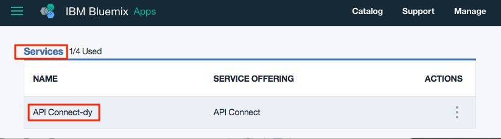
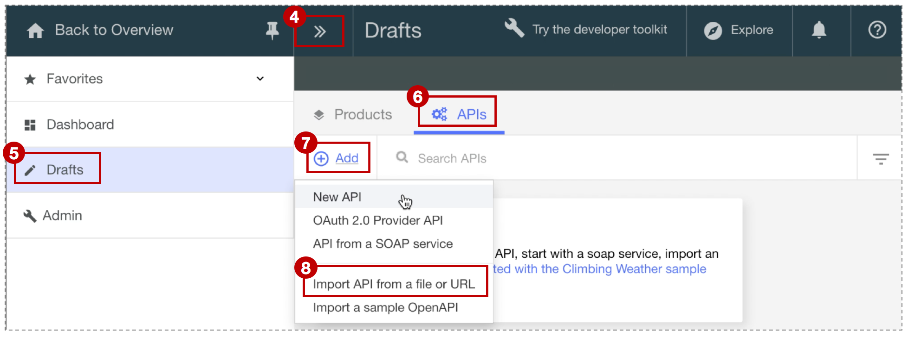
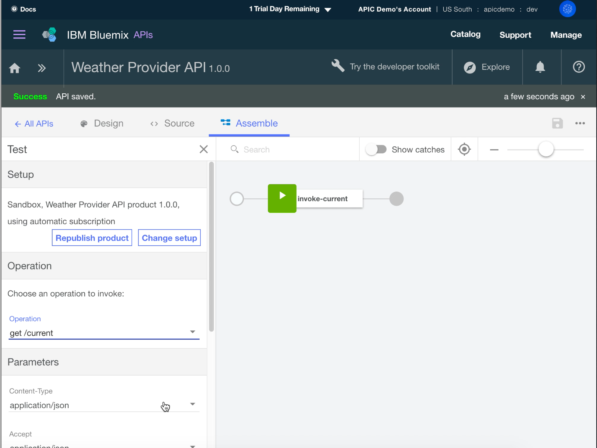
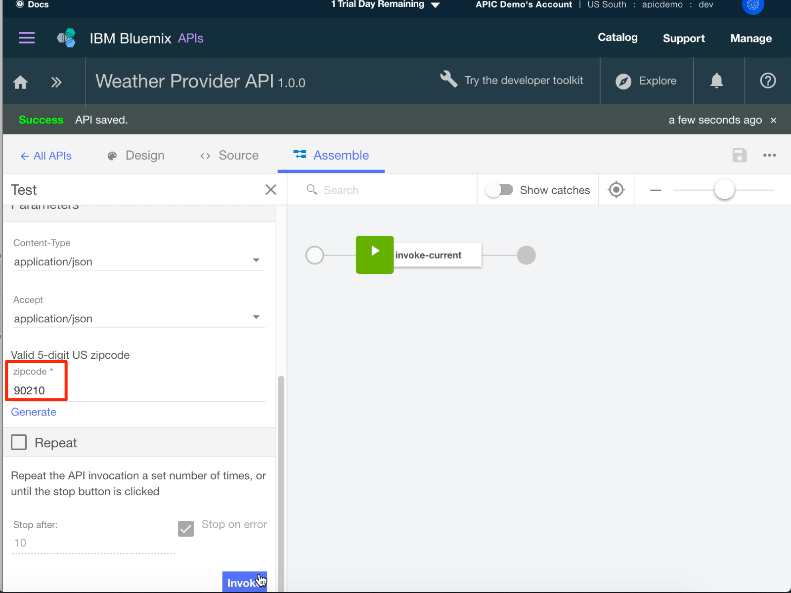
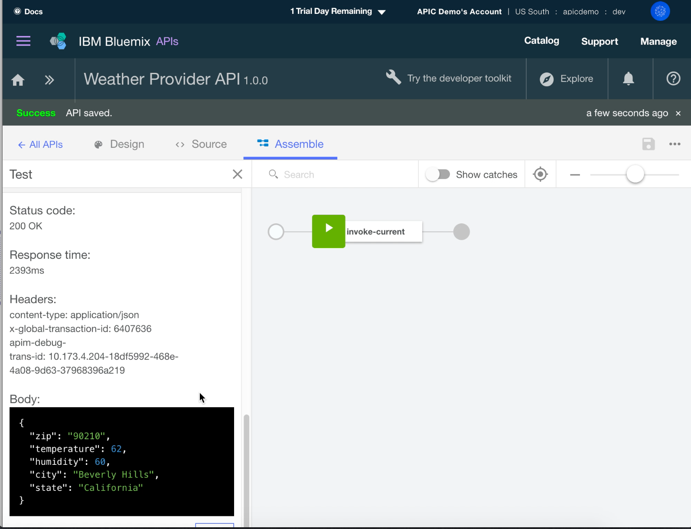

# Import your API spec, and proxy an existing REST service with IBM Bluemix
**Duration:** 5 mins  
**Skill level:** Beginner  

## Objective
This tutorial helps you get started quickly with **IBM API Connect** by illustrating how you can bring your existing API under management control. You'll start by importing an OpenAPI spec, and then create a passthrough API proxy for an existing REST service.

## Prerequisites
Before you begin, you will need to <a href="https://github.com/ibm-apiconnect/getting-started/tree/master/bluemix/0-prereq" target="blank">set up your API Connect instance</a>.

---


## Explore the sample app and test the target endpoints
A sample _weather provider_ app has been created for this tutorial. Its corresponding OpenAPI specification (Swagger 2.0)  .  
1. To explore the app, go to http://gettingstartedweatherapp.mybluemix.net/.  
2. Enter a valid 5-digit U.S. zipcode to get the _**current weather**_ and _**today's forecast**_.  
  

3. The above sample weather app was built using APIs that provide the weather data. The endpoint to get the **current** weather data is _**https:// myweatherprovider<span></span>.mybluemix.net/current?zipcode={zipcode}**_. Test it out by visiting https://myweatherprovider.mybluemix.net/current?zipcode=90210.  
  

4. Similarly, the Endpoint to get **today's** forecast data is _**https:// myweatherprovider<span></span>.mybluemix.net/today?zipcode={zipcode}**_. Test it out by going to https://myweatherprovider.mybluemix.net/today?zipcode=90210.  
  


---

## Import the sample app's OpenAPI spec to create a REST API proxy
1. Log in to Bluemix: https://new-console.ng.bluemix.net/login.
2. Once logged in to Bluemix, scroll down to **All Services**, and click on **API Connect**. 
3. Click on **API Connect** to launch the API Connect service.  
     
  
4. In the API Connect interface, make sure the navigation panel on the left side is open. If not, click **>>** to open it.  
5. Click on **Drafts** in the navigation panel.   
6. Go to the **APIs** tab
7. In the **APIs** tab, click **Add**
8. In the dropdown menu, click **Import API from a file or URL**.  
      
 
9. In the "Import OpenAPI (Swagger)" dialog box that opens, enter the following URL:
https://raw.githubusercontent.com/ibm-apiconnect/getting-started/master/bluemix/1a/weather-provider-api_1.0.0.yaml. Leave the other options with their default values and click **Import**.  
      

10. Once you import the OpenAPI spec, you are taken to the **Design** view. Scroll down to explore, and especially note the **Host** panel.   
    _Note: You'll see that the Host value is set to_ ```$(catalog.host)``` _. This is the base URL for your API proxy._


## Test your API proxy
### Test with the _API Manager test tool_.
1. In the **Assemble** tab, click on **More Actions** then click **Generate a default product**.  
     
  
2. Accept the default options in the **New Product** dialog box, and click **Create Product**. The **Weather Provider API product** is created and published to the Sandbox catalog. A message indicating successful product generation is displayed.  
    
  
   

  > _In API Connect, **Products** provide a way to group APIs that are intended for a particular use. Products are published to a **Catalog**.  [Reference: API Connect glossary]_

3. On the Assemble tab, click ► to test your API proxy's target invocation.  
   a. Choose the **get /current** operation.  
   b. Zipcode is a required parameter for this operation, so enter a valid U.S. zip (for example, 90210).  
   c. Click **invoke**, and verify the response.  
   > _If you run into a CORS error, follow the instructions in the error message. Click the link in the error to add the exception to your browser, and then hit the "invoke" button again._  
  
   d. The expected response is a **200 OK** response code along with  the current weather data for 90210.  
     
     
      


---


### Conclusion
In this tutorial, you saw how an existing REST service can be invoked through an API passthrough proxy. You started by checking the availability of the sample service through the web browser. Then you created an API proxy in API Connect, and linked the proxy to the sample service to be invoked. You packaged your API into a product, published the product to catalog, and tested the proxy.

