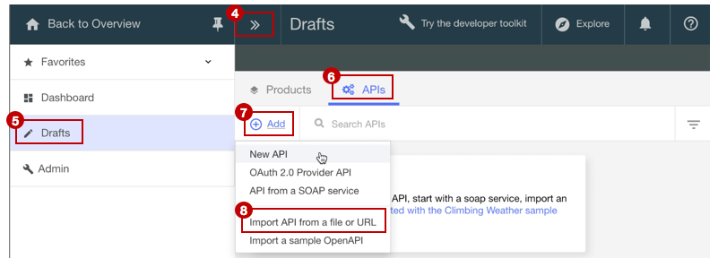

# Import your API spec, and proxy an existing REST service
Duration: 5 mins  
Skill level: Beginner  

<a href="https://github.com/ibm-apiconnect/getting-started/tree/master/bluemix/0-prereq" target="blank">Prerequisites</a>

### Objective
This tutorial is to help you get started quickly with **API Connect** by illustrating how you can bring your existing API under management control. We'll start by importing an OpenAPI spec, and then create a passthrough API proxy for an existing REST service.

---


### Explore the sample app, and test the target endpoints
A sample _weather provider_ app has been created for this tutorial; its corresponding API specification (Swagger 2.0) can be found .
- To explore the app, click: http://gettingstartedweatherapp.mybluemix.net/
- Enter a valid 5-digit US zipcode to get the _**current weather**_ and _**today's forecast**_  


  - Endpoint to get the **current** weather data is:     _**https:// myweatherprovider<span></span>.mybluemix.net/current?zipcode={zipcode}**_
  - Test it out by clicking: https://myweatherprovider.mybluemix.net/current?zipcode=90210  
  

  - Endpoint to get **today's** forecast data is:  
   _**https:// myweatherprovider<span></span>.mybluemix.net/today?zipcode={zipcode}**_
  - Test it out by clicking: https://myweatherprovider.mybluemix.net/today?zipcode=90210  
  


---

### Import the sample app's OpenAPI spec to create a REST API proxy
- Log in to IBM Bluemix: https://new-console.ng.bluemix.net/login
  - In the Bluemix navigation panel (left hand), select **Services** and click **Dashboard**
  - Launch the API Connect service  
        
  - In API Connect, click on **Drafts > APIs**
  - In the **APIs** panel, click on **Add > Import API from a file or URL**  
    
  - We will now import the OpenAPI weather definition.  In the "Import OpenAPI (Swagger) dialog box that pops up, enter this URL:
https://raw.githubusercontent.com/ibm-apiconnect/getting-started/master/bluemix/1a/weather-provider-api_1.0.0.yaml
  - Leave the other options as default and click **IMPORT**  

      

      

- We are just a step away from your API proxy being ready
- In the API's **Design** view, scroll down to the **Host** panel.   
_You'll notice that the Host value is set to myweatherprovider.mybluemix.net. Change this value to_ ```$(catalog.host)``` _. By doing so, you are setting the base URL for your API proxy._
- Save your API  


### Test your API proxy
###### Test with the _API Manager test tool_
- In the **Assemble** tab, select **More Actions > Generate a default product**.

- Accept the default options in the **New Product** dialog pop-up, and select **Create Product**. The **Weather Provider API product** is created and published to the Sandbox catalog.  

  _In API Connect, **Products** provide a mechanism to  group APIs that intended for a particular use. Products are published to a **Catalog**.  [Reference: API Connect glossary]_

- Click ► to test your API proxy's target invocation
  - Choose the newly created default product, and the **get /current** operation.  
  - Zipcode is a required parameter for this operation, so enter a valid US zip (e.g. 90210).  
  - Click **invoke**, and verify that you see:
    - 200 OK response
    - Current weather data for 90210  

    

      


###### Test with the _Explore tool_
- To test your API proxy endpoints
  - Click the _Explore_ button, and select **Sandbox**
    
  - Click on the **GET /current** operation from the palette
  - Enter a valid US zipcode (e.g. 90210) in the test box
  - Click **Call operation** to see the response
  

    
