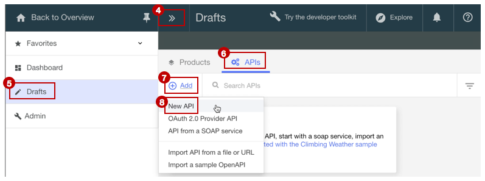

# Add a new API spec and invoke an existing REST service
**Duration**: 15 mins  
**Skill level**: Beginner  

 

### Objective
This tutorial is to help you get started quickly with **API Connect**. We'll start by creating a new OpenAPI spec, and then proxy existing REST services used by the sample weather app.

---


### Explore the sample app and test the target endpoints
A sample _weather provider_ app has been created for this tutorial.
1. Explore this app here: http://gettingstartedweatherapp.mybluemix.net/.
2. Enter a valid 5-digit US zipcode to get the _**current weather**_ and _**today's forecast**_. 


3. Use this endpoint to get the **current** weather data:     _**https://myweatherprovider<span></span>.mybluemix.net/current?zipcode={zipcode}**_.
  - Test it out by clicking: https://myweatherprovider.mybluemix.net/current?zipcode=90210.  
  

4. Use this endpoint to get **today's** forecast data:  
   _**https://myweatherprovider<span></span>.mybluemix.net/today?zipcode={zipcode}**_.
  - Test it out by clicking: https://myweatherprovider.mybluemix.net/today?zipcode=90210.  
  


---

### Add a new OpenAPI spec and invoke an existing REST service
1. Log in to IBM Bluemix: https://new-console.ng.bluemix.net/login.
2. In the Bluemix navigation panel on the left hand, select **Services** and select the **Dashboard**. Launch the API Connect service.
3. In API Connect,   
   (a) Make sure the side-navigation panel (on the left) is open. If not, click the _Navigate to..._ (>>) button to open it.  
   (b) Click on **Drafts** in the side-navigation panel,   
   (c) then click on the **APIs** tab   
   (d) On the **APIs** tab, click on **Add**,  
   (e) and from the dropdown, select **New API**    
    
4. In the New API pop-up, enter "Weather Provider API" for the title.
_The Name and Base Path are auto-populated_  
5. Select **Create API** to complete the wizard.  


6. Once your API is created, you should be in the **Design** tab. 
  - Scroll down to the **Host** panel, and note the value that's filled in: ```$(catalog.host)```.  
  - In the **Base Path** panel, note the auto-populated value: ```/weather-provider-api```.  
  - Your API's target URL will be created from these values.  


7. Scroll down to the **Security** tab, and delete the "clientIDHeader (API Key)" that has been been auto-generated.  
_(We'll visit security with API Keys in the next tutorial.)_  


8. In the left side-navigation panel,   
   (a) Scroll down to the **Paths** panel,   
   (b) Create a new path by clicking on the (+) button  
   (c) Name the new path "**/current**"  
   (d) In the same **Paths** panel, click on the **GET /current** section    
   (e) In the **GET /current** section that opened up, add a new **Parameter**   
      - Name: zipcode  
      - Located in: Query  
      - Required: Yes (check mark)  
      - Type: string   
       
  - Save your API.  

9. In the left side-navigation panel,   
  (a) Scroll down to the **Definitions** panel,   
  (b) Add a new definition  
  (c) Name the new definition _Current_,  
  (d) Set the Type to _Object_  
  (e) Add new properties for the **Current** definition.    
       - Name: zip         /  Type: string   
       - Name: temperature /  Type: integer   
       - Name: humidity    /  Type: integer   
       - Name: city        /  Type: string   
       - Name: state       /  Type: string   
       
  - Save your API.  


10. In the left side-navigation panel, scroll back up to the **Paths** panel.
  - Open the **GET /current** operation, and scroll to the **Responses** section.
  - Change the schema of the 200OK response from "object" to "**Current**".
  - Save your API.
  - The path and operation you created was to get the current weather data. Next you'll need to create the same to get today's weather data.  

11. Similar to how you created the **/current** path in step 8, create a new path: **/today**.
  - Add a new Parameter under the **GET /today** operation.
    - Parameter Name: zipcode
    - Located in: Query
    - Required: Yes (check mark)
    - Type: string  

12. Create a new definition: **Today**.
  - Add new properties for the **Today** definition.
    - Name: zip / Type: string
    - Name: hi / Type: integer
    - Name: lo / Type: integer
    - Name: nightHumidity / Type: integer
    - Name: dayHumidity / Type: integer
    - Name: city / Type: string
    - Name: state / Type: string
  - Update the response schema in the **GET /today** section to "Today".
  - Save your API.

13. Switch over to the **Assemble** tab. You've got two operations so far: **GET /current** and **GET /today**. To ensure the right target endpoint is invoked, you'll need to create some logic that will execute conditional on the operation that's being called. Let's use the **Operation Switch** logic construct to do this.  

   (a) First, delete the **invoke** policy that may already be added to the _canvas_.  
   (b) Then, from the _palette_, drag the **Operation Switch** and drop it on the canvas.  
      - To **case 0**, assign the **get /current** operation.
      - Add a new Case: **case 1**.
      - Assign the **get /today** operation to **case 1**.
       
      - The **Operation Switch** provides a decision point. Based on the verb/path pair, the appropriate operation needs to be invoked.

   (c) Drag the **invoke** policy from the _palette_ and drop it on the canvas.   
      _The invoke action is used to call an existing service from within an operation_  
      - Drop one in the **/get current** path, and one in the **/get today** path.
      - Select the **invoke** policy in the **/get current** path, and update its title to "**invoke-current**".  
      - Update the URL field with https://myweatherprovider.mybluemix.net/current?zipcode=$(request.parameters.zipcode)
      - Select the **invoke** policy in the **/get today** path, and update its title to "**invoke-today**".  
      - Update the URL field with https://myweatherprovider.mybluemix.net/today?zipcode=$(request.parameters.zipcode)  
        

  (d) Save your API.


---

### Test your API proxy
1. In the **Assemble** tab, select **More Actions > Generate a default product**.  
    

2. Accept the default options in the **New Product** dialog pop-up, and select **Create Product**. The **Weather Provider API product** is created and published to the Sandbox catalog.  A message indicating successful product generation is displayed.  
    
  
   
  

  - _In API Connect, **Products** provide a mechanism to  group APIs that intended for a particular use. Products are published to a **Catalog**.  [Reference: API Connect glossary]_

3. Save and click ► to test the API service.
  - Choose the newly created default product, and the **get /current** operation.  
  - Zipcode is a required parameter for this operation, so enter a valid US zip (e.g. 90210).  
  - Click **invoke**, and verify that you see:
    - 200 OK response
    - Current weather data for 90210  

      

      

    

---
