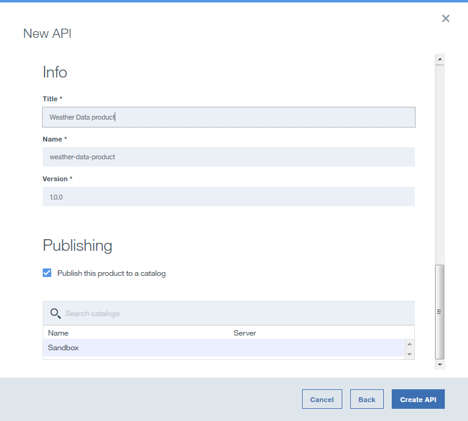
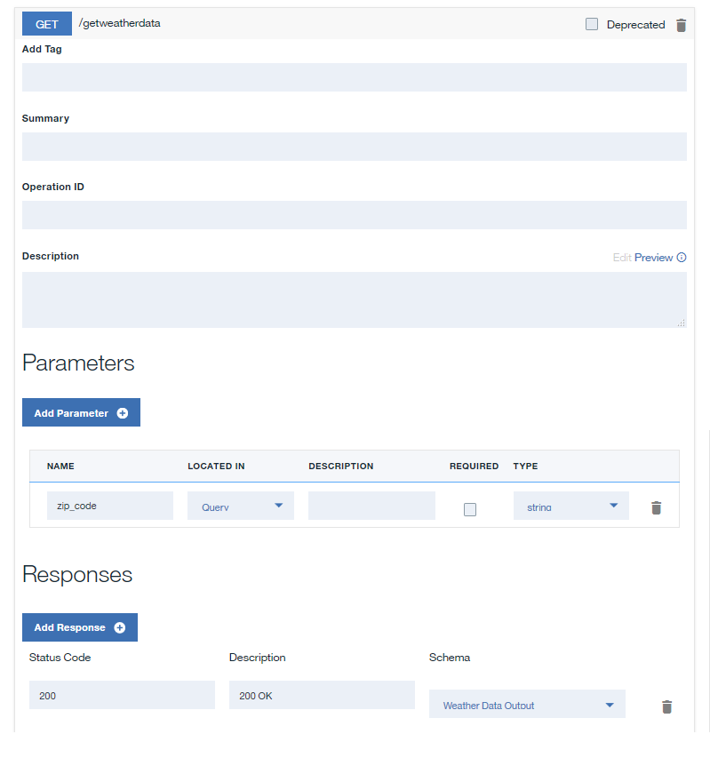
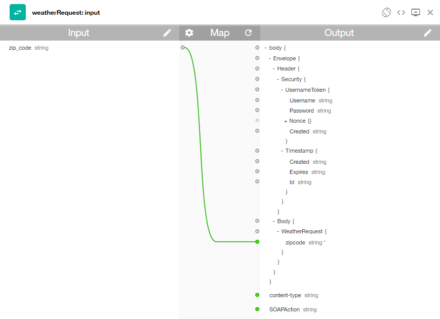

# Exposing a SOAP service as REST
**Duration**: 15 mins  
**Skill level**: Beginner  

---
### Objective
In API Manager, you will create a REST API that accesses a SOAP API to make data from the existing SOAP service available. This tutorial uses the BankA account SOAP service as defined by http://banka.mybluemix.net/services/AccountService?wsdl.

---
### Setting up a REST API definition
1. Log in to IBM Bluemix: https://new-console.ng.bluemix.net/login.
2. In the Bluemix navigation panel on the left hand, select **Services** and select the **Dashboard**. Launch the API Connect service.
3. In API Manager, if you have not previously pinned the UI navigation pane then click the **Navigate to** icon .  The API Manager UI navigation pane opens. To pin the UI Navigation pane, click the **Pin menu** icon .
4. Click **Drafts** in the UI navigation pane and then click the **APIs** tab. The **APIs** tab opens.
5. Click **Add** > **New API**.
6. Specify basic information about the API.
	- In the **Title** field, enter ```Accounts```.
	- Leave the **Name** field as ```accounts``` when it is filled while you enter your title.	
	- Leave the **Base** Path field as ```/accounts```.
	- Leave the **Version** field as ```1.0.0```.
7. Expand **Additional properties** to specify additional properties for the API.
	- From the **API template** field, select **Default** to indicate that you want to use the default template to create the API definition.
	- Leave the remaining fields unchanged.
	
8. Add your API to a new Product and then create the API definition.
	- Click **Add a product**.
	- In the **Title** field, enter ```BankA Services```.
	- Leave the **Name** and **Version** fields unchanged.
	- Ensure that the **Publish this product to a catalog** check box is selected and then select **Sandbox** as the target Catalog.
	
	- Click **Create API**. The **Design** tab for the draft of your API definition opens.
9. In the **Definitions** section, click the **Add Definition** icon  and then expand the new definition by clicking it.
10. Name the definition ```Account Output```.
11. The definition contains a single property. Rename the property to ```Balance``` and, in the **Type** column, select double. Mark the property as required in the * column by selecting the check box. Marking a property as required is reflected to customers in the OpenAPI (Swagger 2.0) definition of the API and can be enforced by a validate policy.
	
12. In the **Paths** section, click the **Add Path** icon .
13. In the **Path** field of your newly created Path, replace the contents with ```/balance```.
14. Expand the **GET /balance** operation by clicking it.
	
15. For your **GET /balance** operation, click **Add Parameter** and then click **Add new parameter**.
16. Name your new parameter ```customer_id``` and mark it as required by selecting the check box. Marking a parameter as required is indicated to users in the OpenAPI (Swagger 2.0) definition of the API, is enforced by validate policies, and will result in the test tool always generating the parameter as part of a sample API call.
17. In the **Schema** column of the **200 OK** response in the **Responses** section, select your **Account Output** definition.
	
18. Click the Save icon  to save your changes.

---
### Adding and configuring your web service invocation
To add and configure the invoke and map policies that integrate your web service into your API definition, complete the following steps:
1. Download the ```files/AccountServices.wsdl```to your local computer
2. In the **Services** section, click the **Add service** icon . The ```"Import web service from WSDL"``` window opens.
3. Click **Upload file**.
4. In the **File Upload** window, specify the location to the ```AccountService.wsld``` file that you downloaded in ```step 1``` and click **Open** to continue.
5. Click **Next**.
5. Select the **AccountService** SOAP service and then click **Done**. In the **Services** section, a web service is listed.
6. Click the **Assemble** tab and then ensure that **DataPower Gateway policies** is selected.
7. Delete the existing **invoke** policy on the canvas by hovering your cursor over the policy and then clicking the **Delete policy** icon .
8. From the palette, drag the **getBalance** web service onto the dashed box that is displayed on the canvas. An invoke policy and two map policies are placed in the assembly. The first map policy assigns variables to the input of your web service invocation, while the second policy assigns outputs of your web service invocation to variables. The outputs of the first map and the inputs of the second map are generated from the WSDL provided in step 3.
9. Click the **getBalance: input** map policy and then click the **Edit inputs** icon  in the Input column of the property sheet.
10. Click **+ input**.
11. Configure the input according to the following table:
	
12. Click **Done**.
13. Click the circle corresponding to **customer_id double** on the input side and then click the circle corresponding to **arg0 integer** on the output side.
	
14. Close the property sheet.
15. Click the **getBalance: output** map policy in the palette and then click the **Edit outputs** icon  in the Output column of the property sheet.
16. Click **+ output**.
17. Configure the input according to the following table:
	
18. Click **Done**.
19. Click the circle corresponding to **return integer** on the input side and then click the circle corresponding to **Balance number** on the output side.
	
20. Click the **Save** icon . to save your changes.

You have included the web service invocation in your assembly and mapped an input parameter to the appropriate part of the SOAP request and mapped the appropriate part of the SOAP response to a JSON output.

---
### Testing your API definition
To test your API definition by using the API Manager test tool, complete the following steps:
1. Click the **Test** icon . The test tool opens.
2. If you have used the test tool before, click **Change setup**.
3. In the **Catalog** field, select your **Sandbox** Catalog.
4. In the **Product** field, select your **BankA Services** Product and then click **Republish product** to publish your Product so that it can be tested.
5. Click **Next**.
6. In the **Operation** field, select **get /balance**.
7. In the **customer_id** field, enter ```12345```.
8. Click Invoke. The response is displayed.

---
### What you did in this tutorial
In this tutorial, you completed the following activities:
1. Set up a REST API definition
2. Configured an API to invoke an existing web service and return its output
3. Tested your API definition

---
