---
 
copyright:
years: 2017
lastupdated: "2017-07-20"
 
---
# Exposing a SOAP service as REST API
**Duration**: 20 mins  
**Skill level**: Beginner  

---
Notes inline from a rewiew requested by Lana Li. Reviewed by @omg. Review stopped mid-way because the entire document does not correlate to the existing BlueMix UI and is unworkable in the present form.

### Objective
In API Manager, you will create a REST API that accesses a SOAP API to make data from the existing SOAP service available. This tutorial uses the weather data SOAP service as defined by https://api.us.apiconnect.ibmcloud.com/dshute-apic-apic-maker/sb/wdata/current. **URL is not functioning**

---
### Setting up a REST API definition
1. Log in to IBM Bluemix: https://new-console.ng.bluemix.net/login.
2. In the Bluemix navigation panel on the left hand,[**new icons in new UI**] select **Services** and select the **Dashboard**. ~~Launch the API Connect service~~ 
Home > Menu > Services > APIs > API Connect >
You are presented with editable **Service name:** change the automatically generated name to "Weather Data". Click create.

If you already have a service, you may see an alert message: "Service broker error: A service instance has already been provisioned in space: xxx-xxx-xxx-xxx" To remove select menu (burger) then Dashboard, and 'more' icon (three vertical dots, not ellipses] 

~~3. In API Connect, if you have not previously pinned the UI navigation pane then click the **Navigate to** icon . The API Manager UI navigation pane opens. To pin the UI Navigation pane, click the **Pin menu** icon .~~
4. Select **Drafts** in the UI navigation pane and then click the **APIs** tab. The **APIs** tab opens.
5. Select **Add** > **New API**.

[__Stopped here because the actual UI is very different than what is described.__]
[__Would it be better to link to other tutorials first?__]
Presently, to reach your API in order to perform the followign steps go **https://console.bluemix.net/apis > click API Connect > ** here you can add one or see one already created. Click to edit attributes. 

6. Specify basic information about the API.
	- In the **Title** field, enter ```Weather Data```.
	- Leave the **Name** field as ```weather-data``` when it is filled while you enter your title.
	Presently the UI shows **Version** next
	then **Description**
	and **Contact**
	and a few other things before showing
	**Host**
	THEN
	- Leave the **Base Path** field as ```/weather-data```.
	
	## Please rewrite this tutorial while viewing current BlueMix UI
	
7. Expand **Additional properties** to specify additional properties for the API.
	- From the **API template** field, select **Default** to indicate that you want to use the default template to create the API definition.
	- Leave the remaining fields unchanged.
	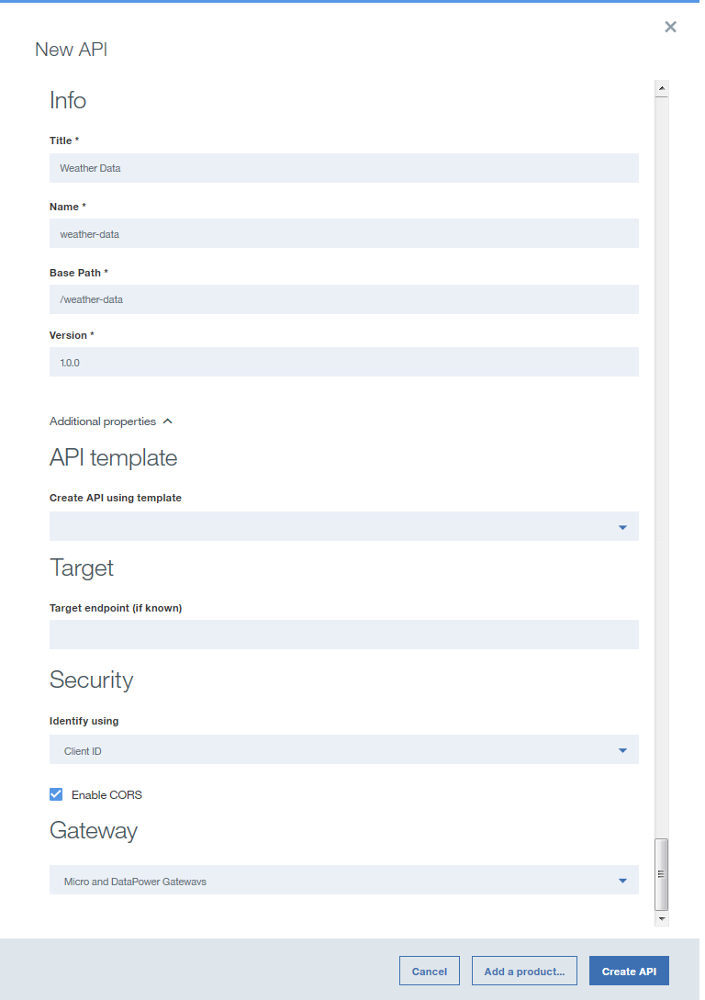
	
8. Add your API to a new Product and then create the API definition.
	- Select **Add a product**.
	- In the **Title** field, enter ```Weather Data product```.
	- Leave the **Name** and **Version** fields unchanged.
	- Ensure that the **Publish this product to a catalog** check box is selected and then select **Sandbox** as the target Catalog.
	
	- Click **Create API**. The **Design** tab for the draft of your API definition opens.
9. Your API is now created. The Design page displays. Click **Security** in the navigation bar.
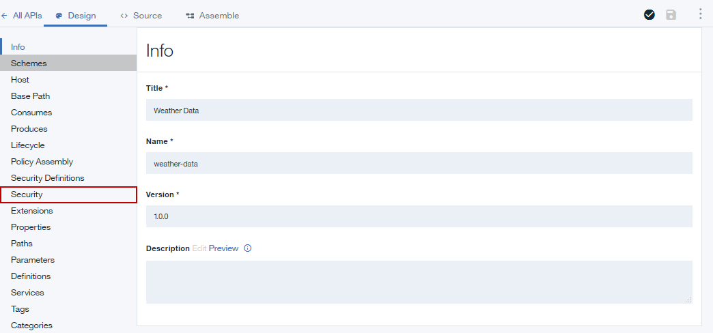
10. Uncheck the **ClientID** option.
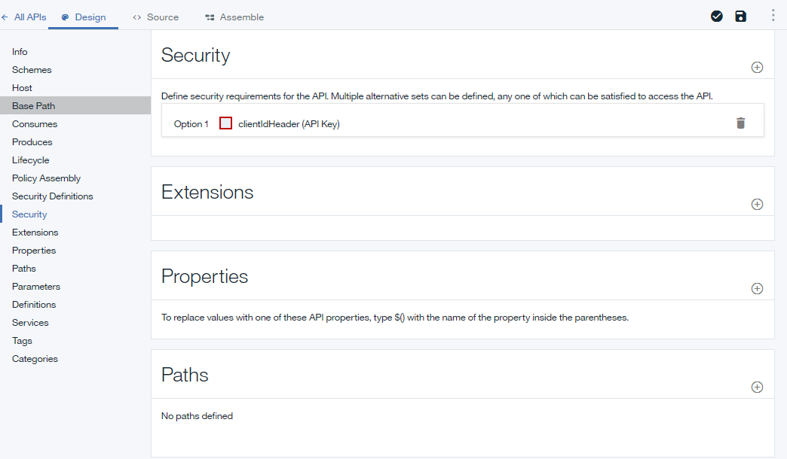
	>![info]
	>You may notice that there is a yellow triangular icon that appears next to the save disk icon.  This is a warning that there are definition that may have been defined but not yet used. (This won't affect the API definition.)
11. In the **Definitions** section, click the **Add Definition** icon  and then expand the new definition by clicking it.
12. Name the definition ```Weather Data Output```.
13. The definition will have five properties. Click **Add Property** four times to add the additional properties. Rename the ```Property Name``` using the following as a guide and use the default for the ```Description```, ```Type``` and ```Example```:
	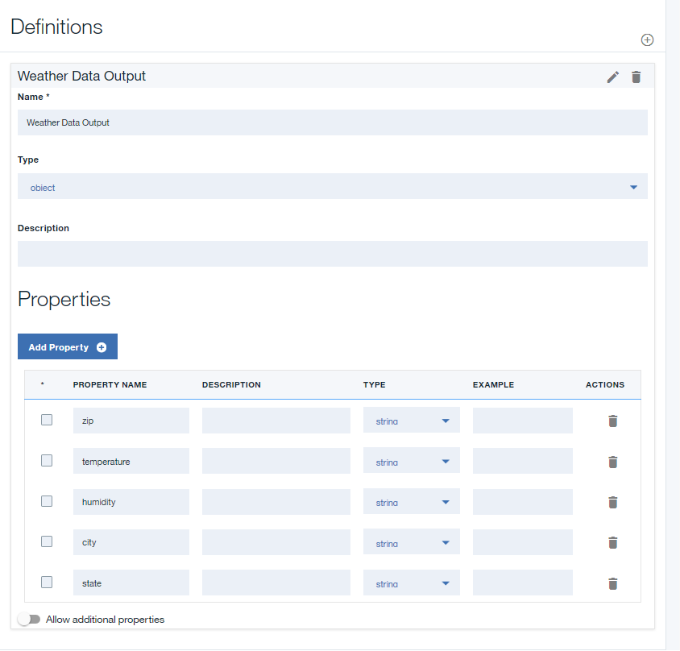
14. In the **Paths** section, click the **Add Path** icon .
15. In the **Path** field of your newly created Path, replace the contents with ```/getweatherdata```.
16. Expand the **GET /getweatherdata** operation by clicking it.
	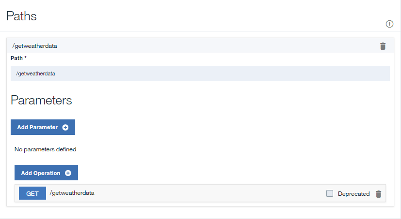
17. For your **GET /getweatherdata** operation, click **Add Parameter**, and then click **Add new parameter**.
18. Name your new parameter ```zip_code``` and leave the rest as default.
19. In the **Schema** column of the **200 OK** response in the **Responses** section, select your **Weather Data Output** definition. For the response to the API call, the object define in by the **Weather Data Output** will be the response object.
	
20. Click the Save icon  to save your changes.

---
### Adding and configuring your web service invocation
To add and configure the invoke and map policies that integrate your web service into your API definition, complete the steps below.
1. Download the ```files/weatherprovider.wsdl``` to your local computer.
2. In the **Services** section, click the **Add service** icon . The ```Import web service from WSDL``` window opens.
	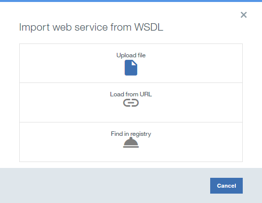
3. Select **Upload file**.
4. In the **File Upload** window, specify the location to the ```weatherprovider.wsdl``` file that you downloaded in ```step 1``` and click **Open** to continue.
5. Click **Next**.
6. Select the **weatherService** SOAP service and then click **Done**. In the **Services** section, **WeatherService** web service is listed with a single **weatherRequest** operation.
	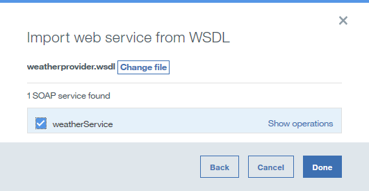

	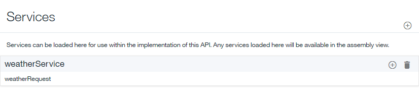	
7. Navigate to the **Assemble** tab and then ensure that **DataPower Gateway policies** is selected.
8. Delete the existing **invoke** policy on the canvas by hovering your cursor over the policy and then clicking the **Delete policy** icon .
	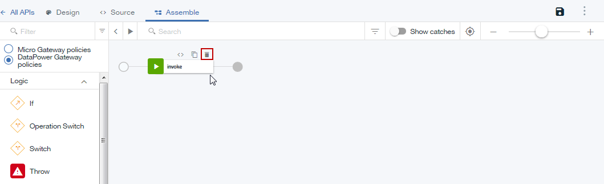	
9. From the palette, drag the **weatherRequest** web service onto the dashed box that is displayed on the canvas. An invoke policy and two map policies are placed in the assembly. The first map policy assigns variables to the input of your web service invocation, while the second policy assigns outputs of your web service invocation to variables. The outputs of the first map and the inputs of the second map are generated from the WSDL provided in step 4.
	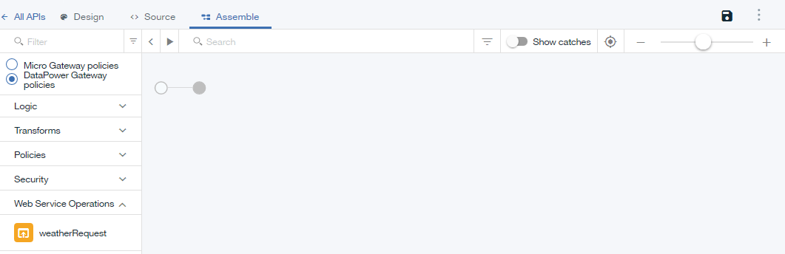	
10. Click the **weatherRequest: input** map policy and then click the **Edit inputs** icon  in the Input column of the property sheet.
		
11. Click **+ parameters for operation** and select ```get /getweatherdata```.
12. Click **Done** to add the ```zip_code``` parameter.
	
13. Click the circle corresponding to **zip_code string** on the input side and then click the circle corresponding to **zipcode string** on the output side.  
	
14. Close the property sheet.
15. Click the **weatherRequest: output** map policy in the palette and then click the **Edit outputs** icon  in the Output column of the property sheet.
16. Select **+ outputs for operation** and select ```get /getweatherdata```.
17. Select **Done** to add the ```Weather Data Output``` output definition.
	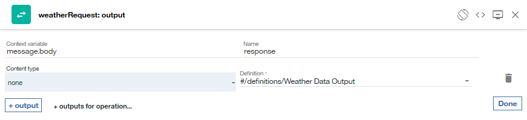
18. Click the circle corresponding to **zip string** on the input side and then click the circle corresponding to **zip string** on the output side. Map the remaining parameters using the following as a guide.
	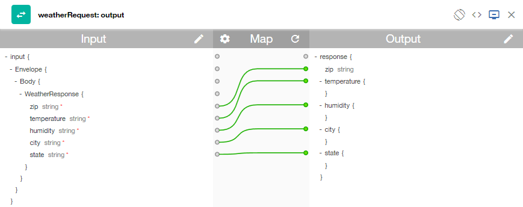
19. Click the **Save** icon  to save your changes.

You have included the web service invocation in your assembly and mapped an input parameter to the appropriate part of the SOAP request and mapped the appropriate part of the SOAP response to a JSON output.

---
### Testing your API definition
To test your API definition by using the API Manager test tool, complete the steps below.
1. Click the **Test** icon  under the **Assembly** tab to reveal the test pane.
	
2. If you have used the test tool before, click **Change setup**.
3. Choose ```Weather Data product 1.0.0``` from the list of products.
	
3. Click **Republish product**.
5. Click **Next**.
6. Select ```get /getweatherdata``` from the list of operations.
	
8. Scroll down to the **zip_code** field, enter ```90210```.
	
9. Click **Invoke**. The API returns the current weather.
	
---
### What you did in this tutorial
In this tutorial, you completed the following activities:
1. Set up a REST API definition
2. Configured an API to invoke an existing web service and return its output
3. Tested your API definition

---

[important]: ./images/important.png "Important!"
[info]: ./images/info.png "Information"
[troubleshooting]: ./images/troubleshooting.png "Troubleshooting" 
