---

copyright:
  years: 2017
lastupdated: "2017-06-01"

---


{:new_window: target="_blank"}
{:shortdesc: .shortdesc}
{:screen: .screen}
{:codeblock: .codeblock}
{:pre: .pre}

# Getting Started Discovering APIs
**Duration**: 30 mins  
**Skill level**: Beginner  

### Objective
This tutorial will help you get started using the **API Connect Developer Portal**. You will learn the following: 

* Explore Products & APIs
* View & Test APIs
* Subscribe to APIs  

### Before you begin
You must have an **API Connect Developer Portal** installed.
 
---

### Explore Products & APIs
In this tutorial, you will explore the products and APIs in the developer portal.

1. In a browser navigate to your **API Connect Developer Portal**.
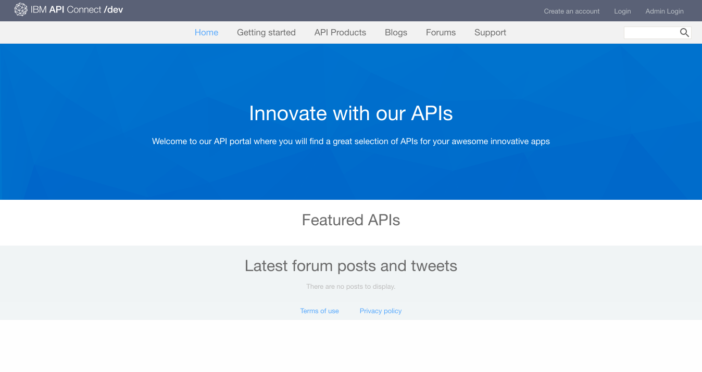

2. In the API Connect Developer Portal select the **API Products** tab. 
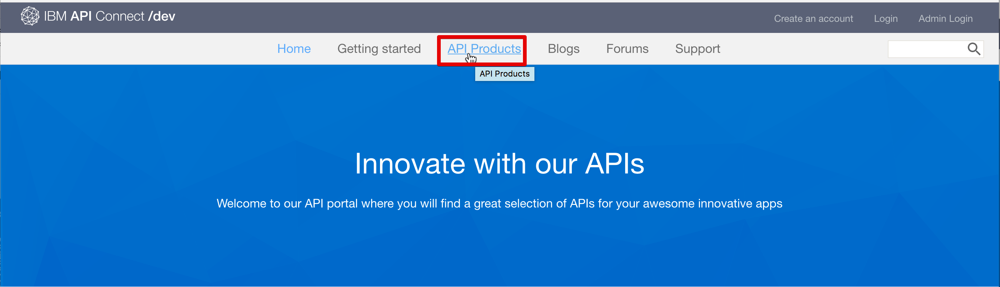

3. Select one of the available **API products** to display the available APIs and Plans for the product.  
  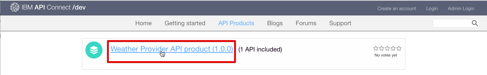

4. Select an **API** to explore the details of its available APIs.  
  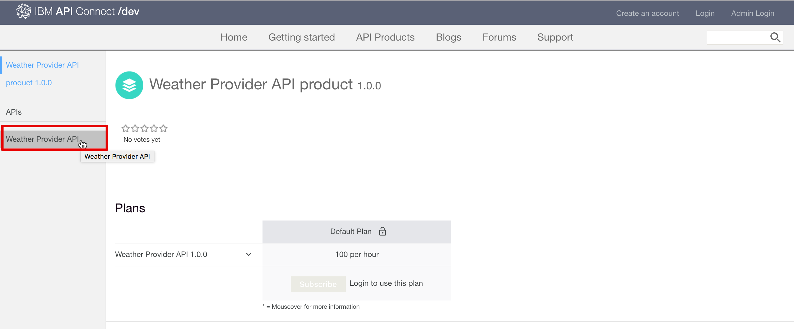

5. In the details page of an API you can view the available operations along with their parameters and the responses returned.  At the bottom of the page you can view the definitions used by the API.  
   

6. In the right panel of the page you can view different examples of how to invoke the requests and their responses. Select one of the different examples such as **Node** to see an example in that language.  
  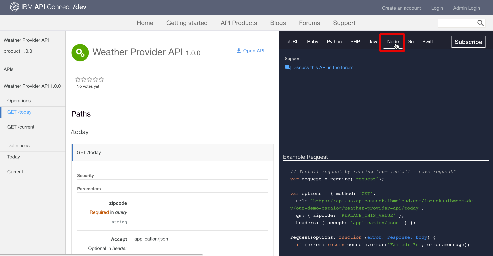 

---

### View and test the APIs
In this tutorial, you will learn how to view and test the APIs available in a product.

1. Navigate to the API details in the API Connect Developer portal as outlined above.  
  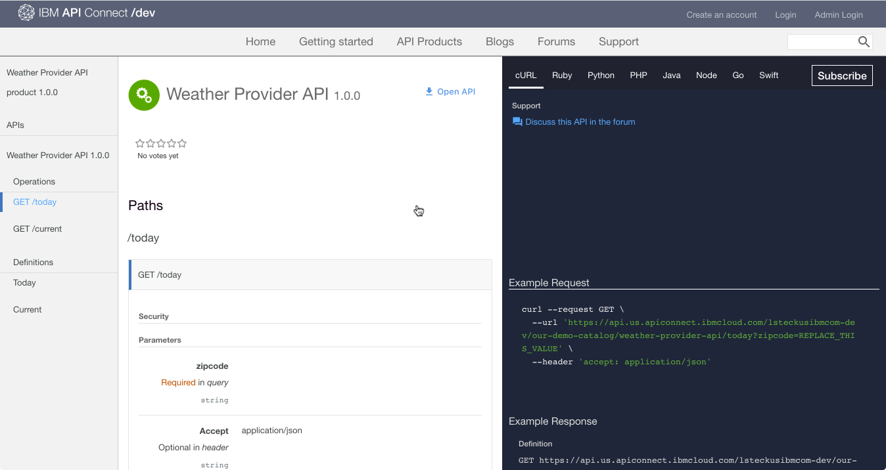 

2. You can download and view the APIs Swagger yaml by selecting **Open API**.  
  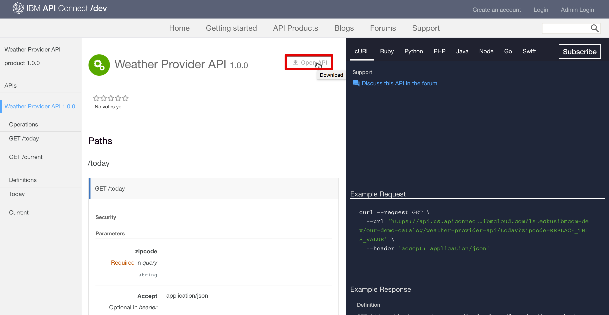 

3. Scroll down to one of the operations to view its details.  You can also click on the operations link to jump to it on the page. 
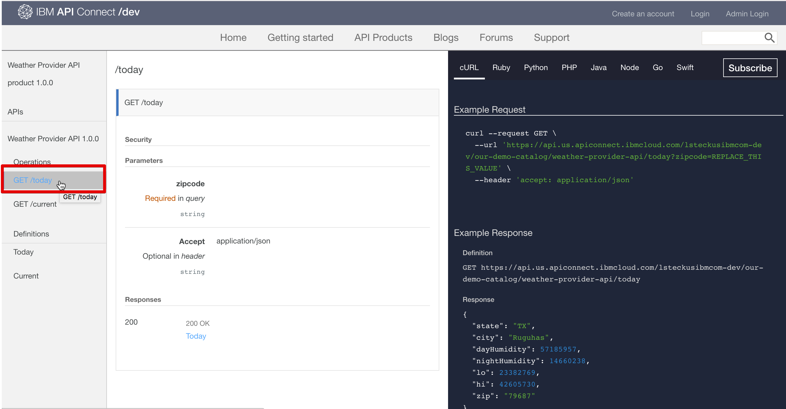

4. In the right panel under the examples scroll down to the **Try this operation** section. Enter the parameters and select **Call operation** 
  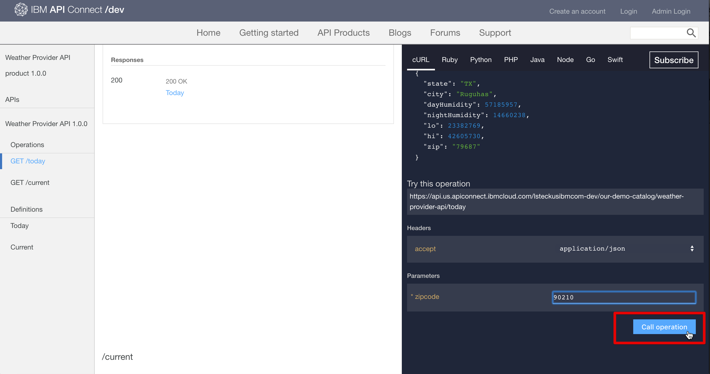

5. Scroll down to view the request and response of the operation call.  A returned response of **200 OK** and the message body are displayed, indicating that the operation call was successful.  
  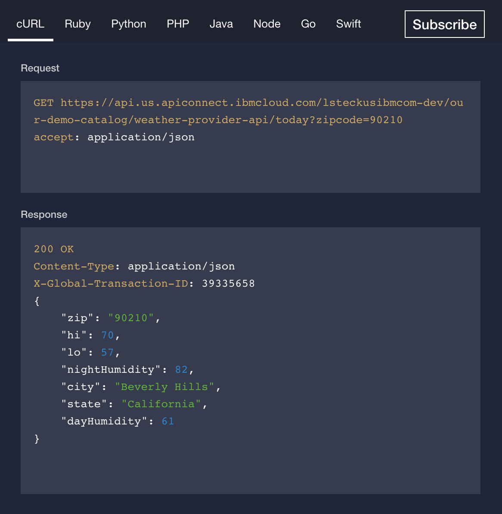

---

### Subscribe to APIs
In this section you will learn how to subscribe to APIs in the developer portal. Before you can subscribe to an API you must login and create an application.

1. Select **Login** to log into the developer portal.
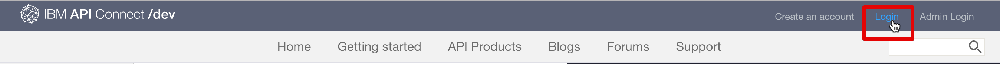

2. Enter your IBM ID and password. Select **Sign in**.  
  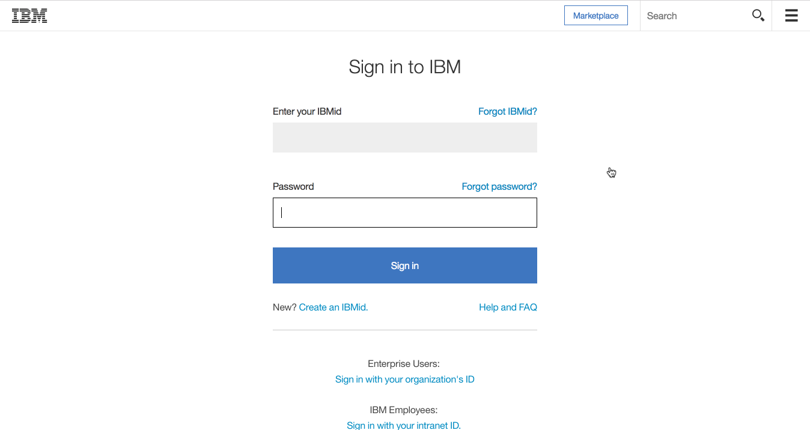

3. Select **Apps** to go to the registered apps page.  
  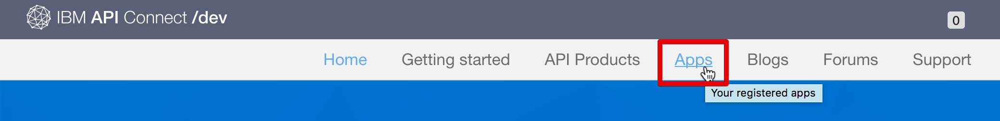

4. To register a new application select **Create new App**.  
  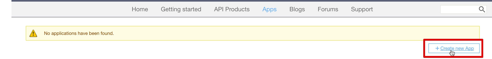

5. Enter a *Title* and *Description* for your app and select **Submit**.  
  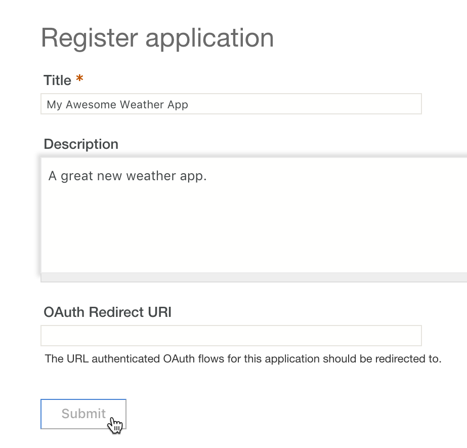 

6. Now that you have an App you can subscribe to API Product plans.  Select **available APIs** or **API Products** to browse the API Product plans.  
   

7. Select the **API Product** you wish to subscribe too.  
   

8. Select **Subscribe** to subscribe to the API Product Plan.  
   

9. Select the **app** you wish to subscribe to the product plan then select **Subscribe**. 
  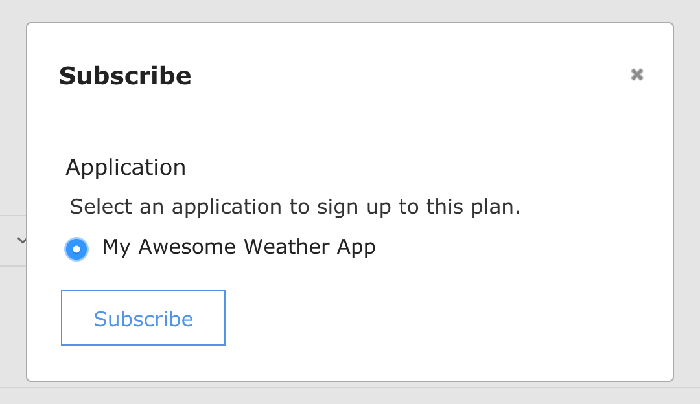 

10. Your application has successfully subscribed to the product plan. 
   

This completes this tutorial.

  

  
