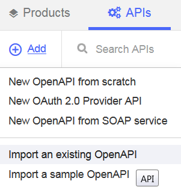

---
 
copyright:
years: 2017
lastupdated: "2017-06-08"
 
---
# Managing a SOAP service
**Duration**: 15 mins  
**Skill level**: Beginner  

---
### Objective
In API Manager, you will create a SOAP API that is a proxy for a SOAP-based weather service.  This tutorial uses the weather data SOAP service as defined by https://api.us.apiconnect.ibmcloud.com/dshute-apic-apic-maker/sb/wdata/current.

---
### Setting up a SOAP API definition
1. Log in to IBM Bluemix: https://new-console.ng.bluemix.net/login.
2. In the Bluemix navigation panel on the left hand, select **Services** and select the **Dashboard**. Launch the API Connect service.
3. In API Manager, if you have not previously pinned the UI navigation pane then click the **Navigate to** icon .  The API Manager UI navigation pane opens. To pin the UI Navigation pane, click the **Pin menu** icon .
4. Click **Drafts** in the UI navigation pane and then click the **APIs** tab. The **APIs** tab opens.
5. Click **Add** > **New OpenAPI from SOAP service**.

6. The New API from WSDL dialog box opens.  Click **Upload File**.

7. Select the ```weatherprovider.wsdl``` file.
8. The New API from WSDL dialog box reappears.  Check the **weatherService** check box. Click **Add a product**.

9. Select the catalog desired.  Sandbox is the default.  Click **Done**.

10.Your API is now created. The Design page displays. Click **Security** in the navigation bar.

11.	Uncheck the **ClientID** option.

12.	Click the disk icon in the upper right corner to save your changes.
13.	Click **Assemble**.
14.	Click the **Proxy** icon.  Notice the target URL.

15.	Click **X** to close the Proxy configuration pane.

---
### Testing the SOAP API definition
1.	Click the **test arrow** to reveal the test pane.

2. Click **Change setup**.
3.	Choose ```weatherService product 1.0.0``` from the list of products.

4.	Click **Republish product**.
5.	Click **Next**.
6.	Select ```post /weatherRequest``` from the list of operations.

7.	Scroll down. Enter the following xml in the body field.
````<?xml version="1.0" encoding="UTF-8"?>
<soap:Envelope xmlns:xsi="http://www.w3.org/2001/XMLSchema-instance" xmlns:xsd="http://www.w3.org/2001/XMLSchema" xmlns:soap="http://schemas.xmlsoap.org/soap/envelope/">
   <soap:Body>
<wdata:WeatherRequest xmlns:wdata="http://www.ibm.com/wdata">
       <zipcode>90210</zipcode>
</wdata:WeatherRequest>
   </soap:Body>
</soap:Envelope>````

8.	Click **Invoke**.
The API returns the current weather.


### What you did in this tutorial
In this tutorial, you completed the following activities:
1. Set up a SOAP API definition
2. Tested your API definition

---
