---
 
copyright:
years: 2017
lastupdated: "2017-08-01"
 
---
# Updating and Removing API Products
**Duration**: 15 mins  
**Skill level**: Intermediate  

[Prerequisites](https://github.com/ibm-apiconnect/getting-started/blob/master/bluemix/0-prereq/README.md)

Complete the Superceding an Existing API tutorial.

---
### Objective
In this tutorial, you will retire, archive and delete APIs.

---
### Deleting an API Product
1. Log in to IBM Bluemix: https://new-console.ng.bluemix.net/login.

2. In the Bluemix **Dashboard**, launch the API Connect service.
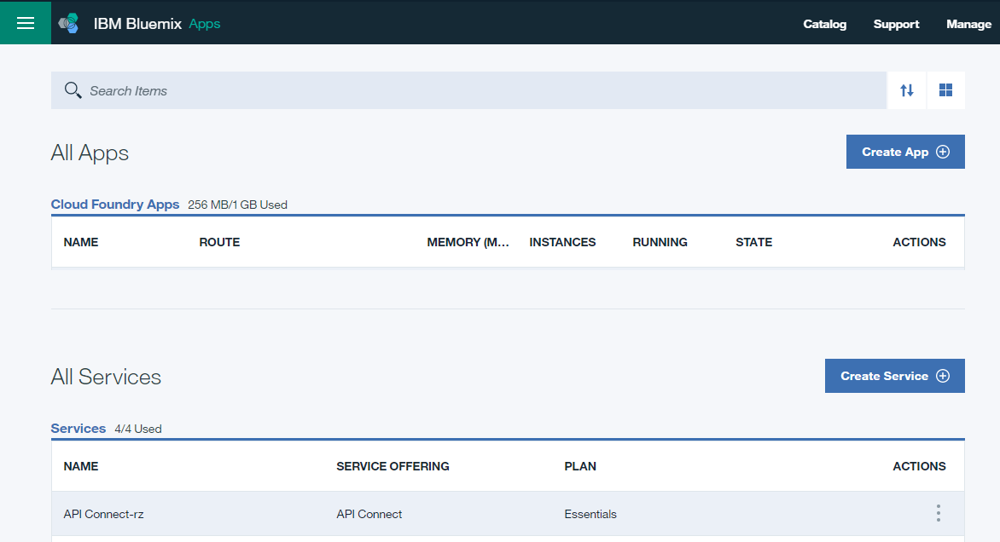

3. In API Manager, if you have not previously pinned the UI navigation pane then click the **Navigate to** icon .  The API Manager UI navigation pane opens. To pin the UI Navigation pane, click the **Pin menu** icon .

4. Click **Sandbox** to open the Sandbox catalog.  

  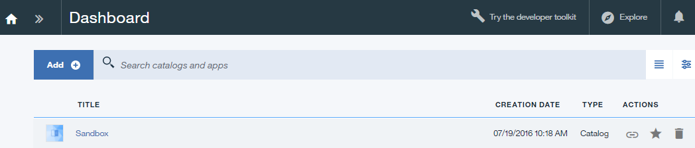

5. Click the three vertical dots on the line listing **Weather Provider API 1.0.0**.  

  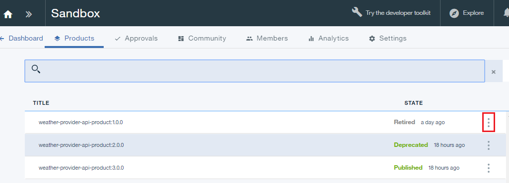

6. Select **Delete from catalog**.  

  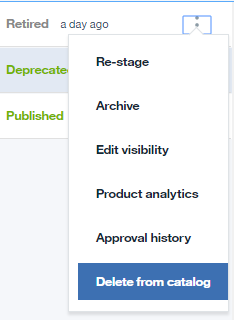

7. Click **OK**.  

  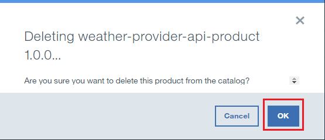

The product disappears from the list of products in the catalog.  It cannot be recovered at this point.

### Archiving an API Product
1. Click the three vertical dots on the line listing **Weather Provider API 2.0.0**.  

  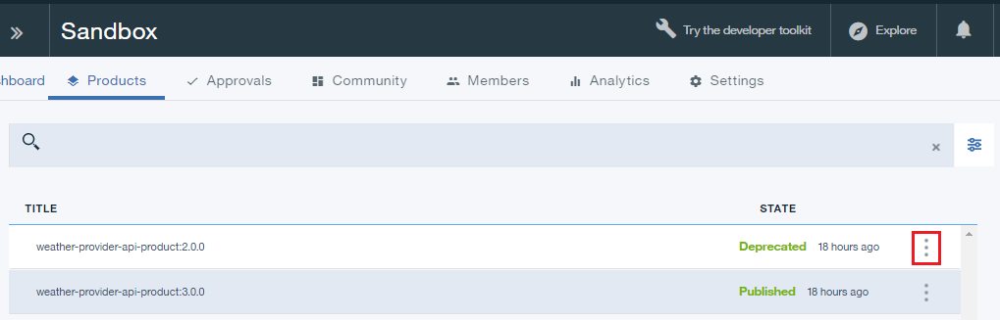

2. Select **Retire**.  

  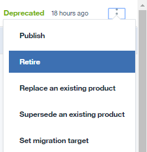

3. Click **OK**.  

  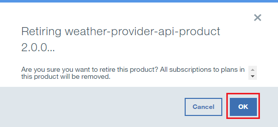

4. Click the three vertical dots on the line listing **Weather Provider API 2.0.0**.  

  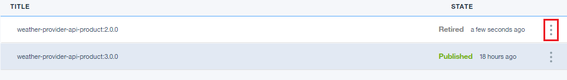

5. Select **Archive**.  

  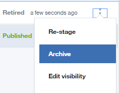

6. Click **OK**.  

  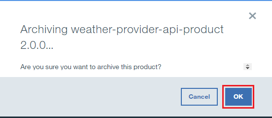

The product disappears from the list of products in the catalog.  It can be recovered.

7. Click the list view icon.  

  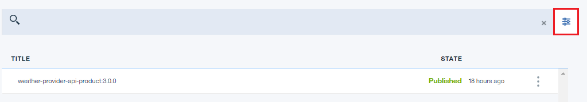

8. Check **Archived**.  

  

9. Click the three vertical dots on the line listing **Weather Provider API 2.0.0**.  

  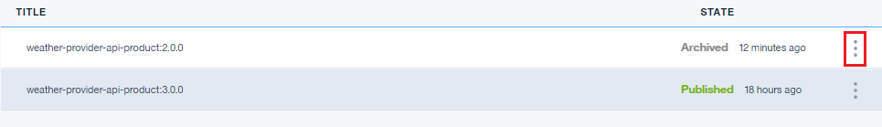

10. Select **Unarchive**.  

  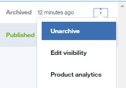

The product state changes to Retired.

  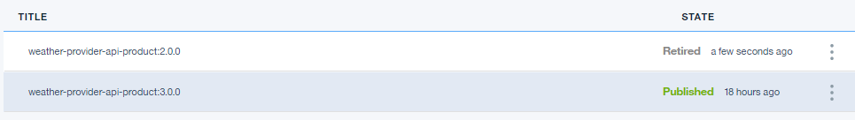

 
 
### What you did in this tutorial
In this tutorial, you completed the following activities:
1. Deleted an API Product
2. Retired an API Product
3. Archived an API Product
4. Unarchived an API Product

---
