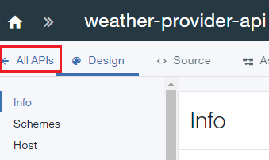
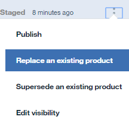

---
 
copyright:
years: 2017
lastupdated: "2017-08-04"
 
---
# Replacing an API Product
**Duration**: 15 mins  
**Skill level**: Beginner  

[Prerequisites](https://github.com/ibm-apiconnect/getting-started/blob/master/bluemix/0-prereq/README.md)

Complete the Proxy REST API tutorial.

---
### Objective
In this tutorial, you will update an existing API product by replacing it with a newer one.

When an API product is **replaced**, the changes take effect immediately and all application subscriptions are updated automatically.  

---
### Replacing an API Product
1. Log in to IBM Bluemix: https://new-console.ng.bluemix.net/login.

2. In the Bluemix **Dashboard**, launch the API Connect service.

3. In API Manager, if you have not previously pinned the UI navigation pane then click the **Navigate to** icon .  The API Manager UI navigation pane opens. To pin the UI Navigation pane, click the **Pin menu** icon .

4. Click **Drafts** > **APIs**.

5. In the APIs panel, click **Weather Provider API** open the REST proxy API.  

6. Change the **Version** to 2.0.0.  

7. Click the disk icon to save the API changes.  

8. Click **All APIs**.  

9. Click **Products**.  

10.	Click **Weather Provider API Product**.  

11.	Change the **Version** to 2.0.0. Enter ``Updated API`` in the **Description** field.  Click the disk icon to save the changes.  

12.	Click **Stage**.  

13.	Click **>>** to open the navigation menu, then select Dashboard.  

14.	Click **Sandbox**.  

15.	Click the three vertical dots on the **Weather Provider API Product 2.0.0 Staged** line.  

16.	Select **Replace an existing product**.  

17.	Select **Weather Provider API Product 1.0.0** in the list of products presented.  Click **Next**.  

18.	Select **Default plan**.  Click **Replace**.  

As a result of this replacement, the Weather Provider API Product 1.0.0 is retired, and the Weather Provider API Product 2.0.0
 is published.  

 
  
 

### What you did in this tutorial
In this tutorial, you completed the following activities:
1. Updated an API Product
2. Replaced an existing API Product with an updated API Product

---
