---
 
copyright:
years: 2017
lastupdated: "2017-08-01"
 
---
# Updating and Removing API Products
**Duration**: 15 mins  
**Skill level**: Intermediate  

[Prerequisites](https://github.com/ibm-apiconnect/getting-started/blob/master/bluemix/0-prereq/README.md)

Complete the Superceding an Existing API tutorial.

---
### Objective
In this tutorial, you will retire, archive and delete APIs.

---
### Deleting an API Product
1. Log in to IBM Bluemix: https://new-console.ng.bluemix.net/login.

2. In the Bluemix **Dashboard**, launch the API Connect service.

3. In API Manager, if you have not previously pinned the UI navigation pane then click the **Navigate to** icon .  The API Manager UI navigation pane opens. To pin the UI Navigation pane, click the **Pin menu** icon .

4. Click **Sandbox** to open the Sandbox catalog.

5. Click the three vertical dots on the line listing **Weather Provider API 1.0.0**.

6. Change the **Version** to 3.0.0.

7. Click the disk icon to save the API changes.
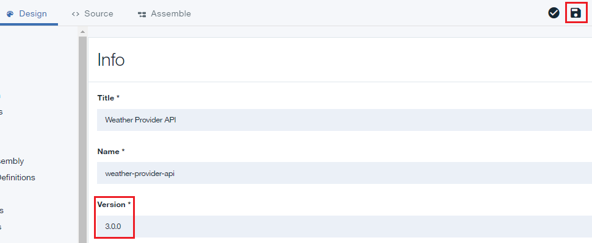

8. Click **All APIs**.

9. Click **Products**.
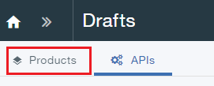

10.	Click **Weather Provider API Product 2.0.0**.
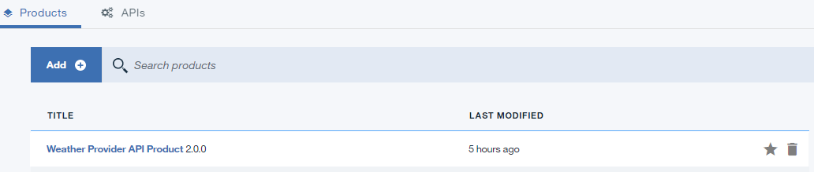

11.	Change the **Version** to 3.0.0. Click the disk icon to save the changes. Click **Stage**.
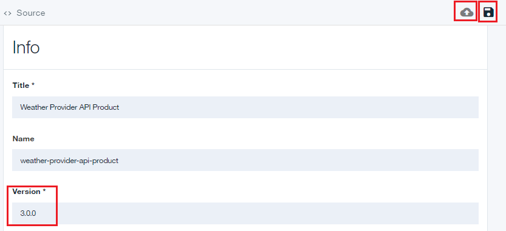

12.	Click **>>** to open the navigation menu, then select Dashboard.
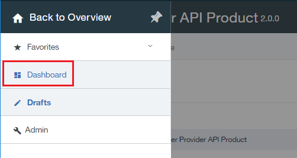

13.	Click **Sandbox**.

14.	Click **Community**.
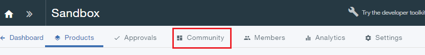

15.	Click **Subscriptions**.  
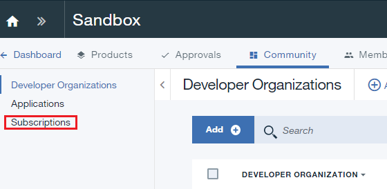

16.	Note the application subscriptions to Weather Provider API Product 2.0.0.  Click **Products**.
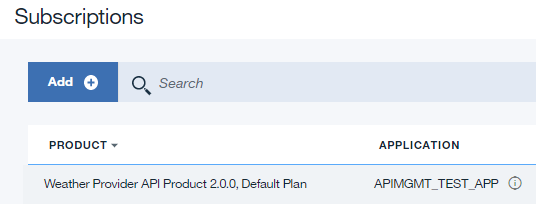

17.	Click the three vertical dots on the **Weather Provider API Product 3.0.0 Staged** line.
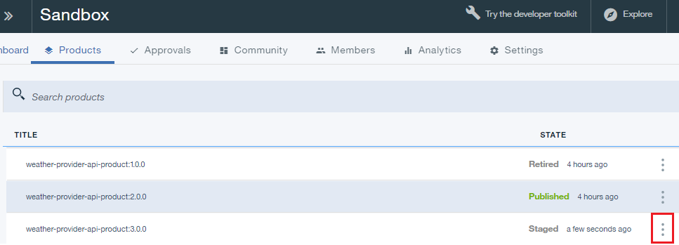

18.	Select **Supercede an existing product**.
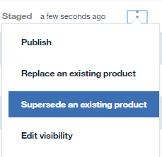

19.	Select **Weather Provider API Product 2.0.0** in the list of products presented.  Click **Next**.
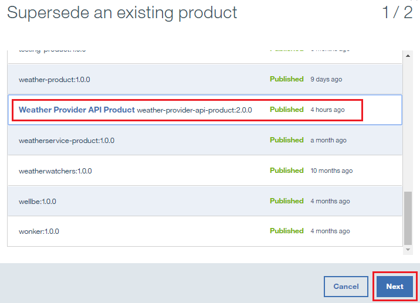

20.	Select **Default plan**.  Click **Supercede**.
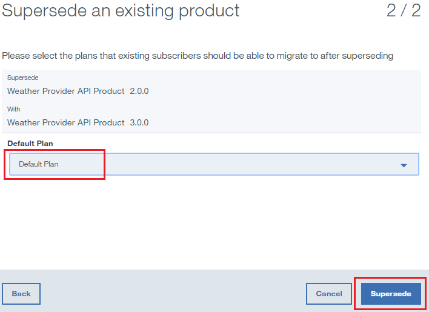

As a result of this replacement, the Weather Provider API Product 2.0.0 is deprecated, and the Weather Provider API Product 3.0.0 is published.
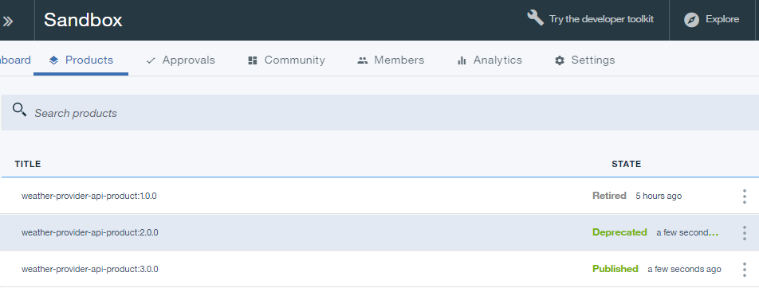 
 
21.	Click **Supercede >> Subscriptions**.

 
22.	Click the three vertical dots on the **Weather Provider API Product 2.0.0** line.  Select **Manage**.
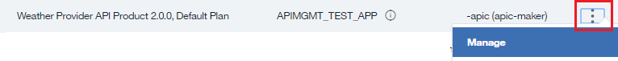 

23.	Select **Default plan** under Weather Provider API Product 3.0.0 .  Click **Migrate**.
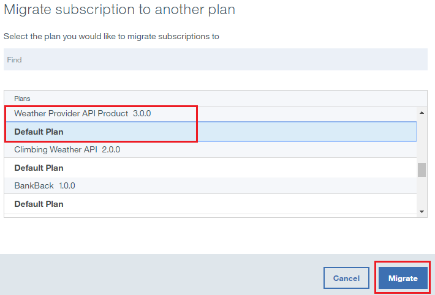

As a result of this migration, the Weather Provider API Product 2.0.0 is migrated to Weather Provider API Product 3.0.0.
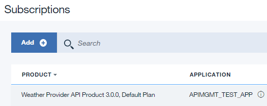 
 
 
### What you did in this tutorial
In this tutorial, you completed the following activities:
1. Updated an API Product
2. Superceded an existing API Product with an updated API Product
3. Migrated the subscription to the existing API product to the updated API product.

---
