---

copyright:
  years: 2017
lastupdated: "2017-05-16"

---

{:new_window: target="_blank"}
{:shortdesc: .shortdesc}
{:screen: .screen}
{:codeblock: .codeblock}
{:pre: .pre}

# Set Up and Configure Your Developer Portal
**Duration**: 30 mins  
**Skill level**: Beginner  

### Objective
This tutorial is to help you get started quickly with Configuring your **API Connect Developer Portal**. 

---

### Create your developer portal
In this tutorial, you will create a developer portal for a catalog.

1. In your Bluemix dashboard select your **API Connect** service to launch the API Connect dashboard.

2. In the API Connect dashboard select the catalog for which you want to create a developer portal, for example **Our Demo Catalog**.

Catalogs are an IBM term for different enviornments. For example you would create different catalogs for your testing, stagging and production enviornments. You should have a catalog called Sandbox, and feel free to use this catalog to create your developer portal. Or create a new one and name it whatever you want!  
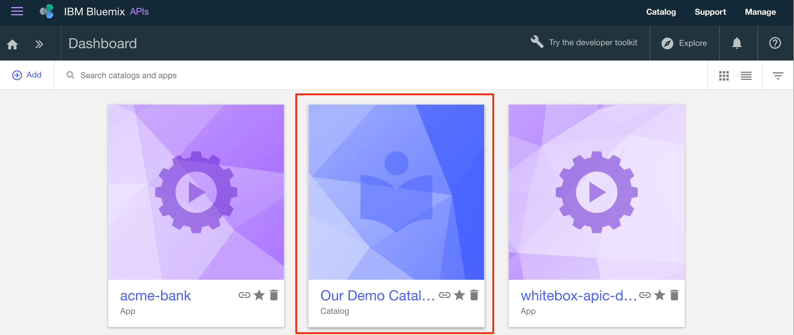

3. In the catalog select the **settings** tab.  
  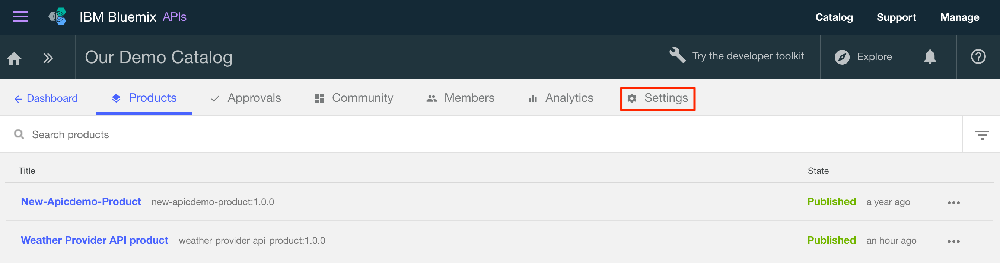

4. In the setting tab select **portal**.  
  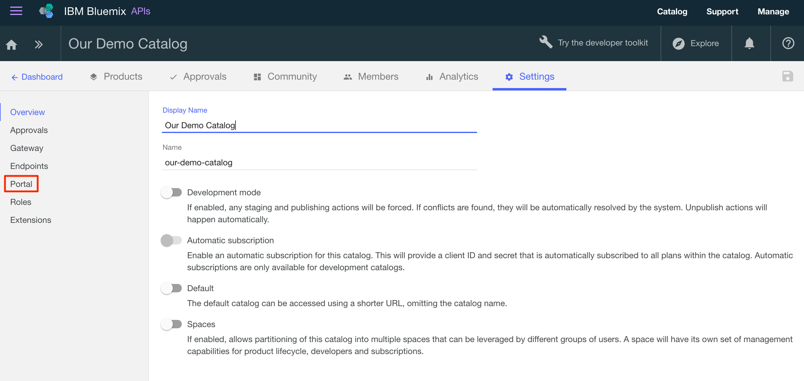

5. In the Portal Configuration, Select Portal dropdown select **IBM Developer Portal**.  
  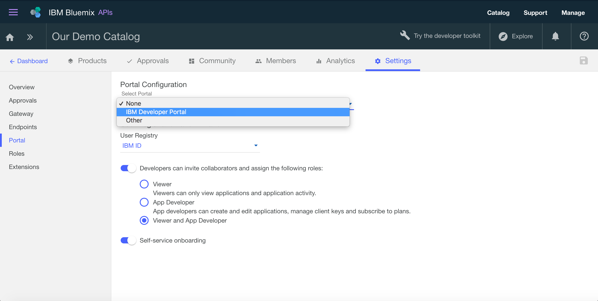 

6. Save your changes.  
  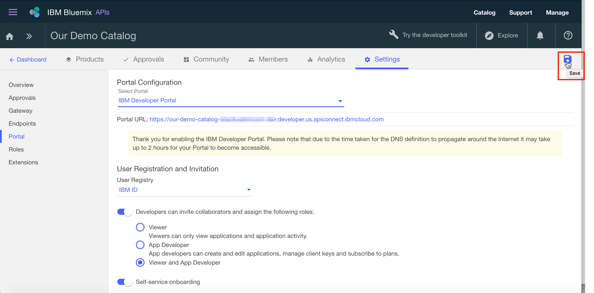
  
7. Select **OK** to acknowledge the dialog message.  
  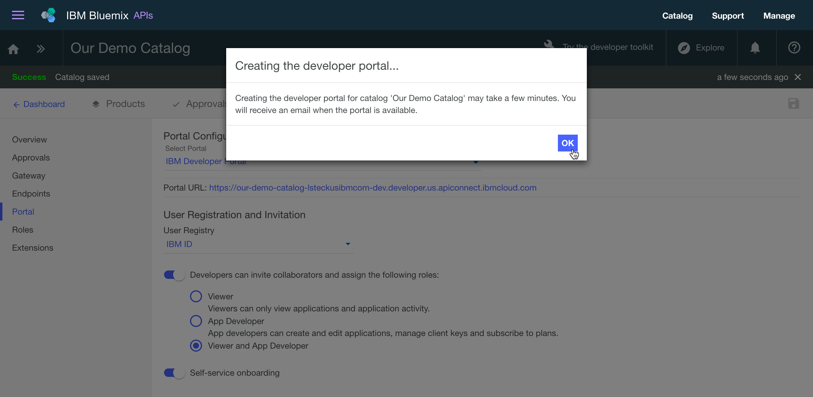

---

### Explore your developer portal
In this tutorial, you will get acquainted with the developer portal created above.

1. After you configured the developer portal for your catalog above you will receive an email with a link to a one-time login. Select the link to launch the developer portal.

2. Select **Login** to login to the developer portal. 
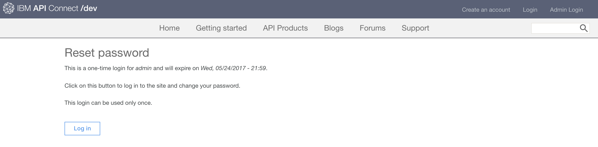

3. Enter a new password and select **Save**.  
  

4. Now that you've set your password let's explore the developer portal. Select **Home** at the top of the page.  
  

5. The Home page is the welcome page to your developer portal. You can customize this page a we will see later in the tutorial.  When you've finished reviewing the home page select **Getting started**.   
  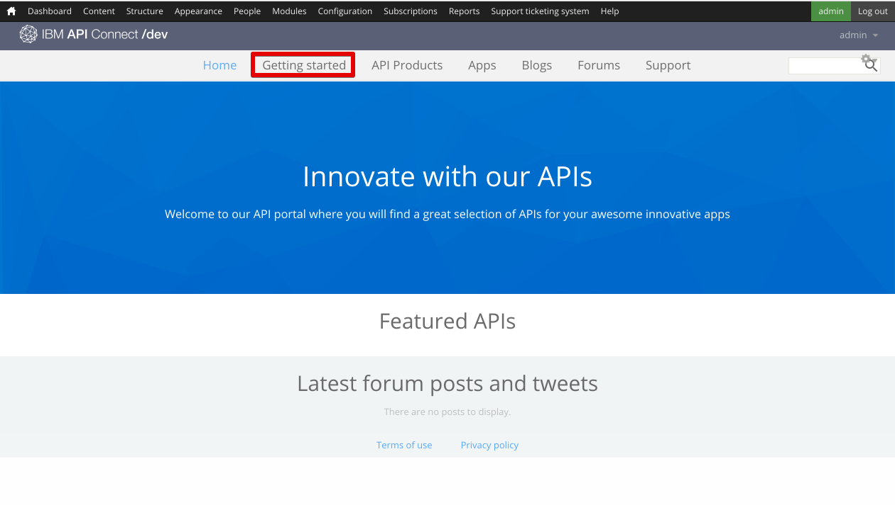 

6. The Getting started page is used to instruct developers how to get started using your developer portal.  When you've finished reviewing the page select **API Products**.
  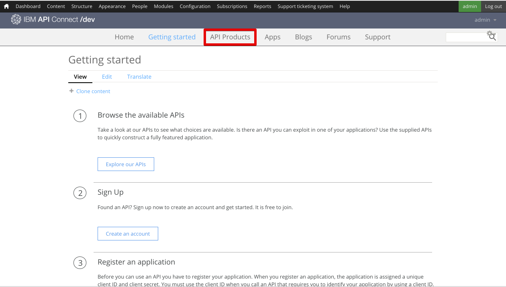

7. The API Products page is used by developers to explore and subscribe to the APIs that are available on your portal.  When you've finished reviewing the page select one of the products.  
  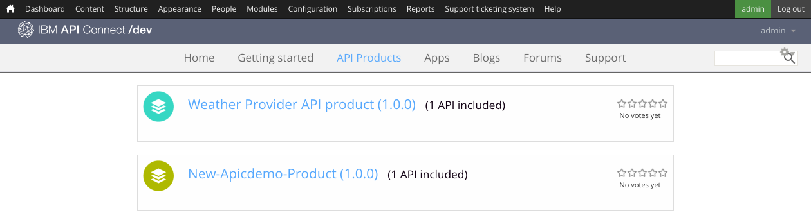

8. The Product page for an API shows the available plans for the product and enables developers to subscribe to and view the API details.  When you've finished reviewing the page select **Apps**.  
  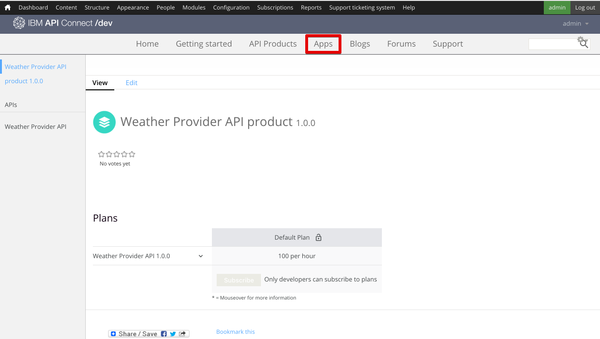

9. The Apps page displays the applications that are using your APIs.  When you've finished reviewing the page select **Blogs**.  
  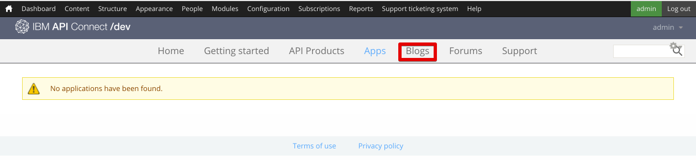

10. The Blogs page is where you can create and display blog posts about your APIs.  When you've finished reviewing the page select **Forums**.  
  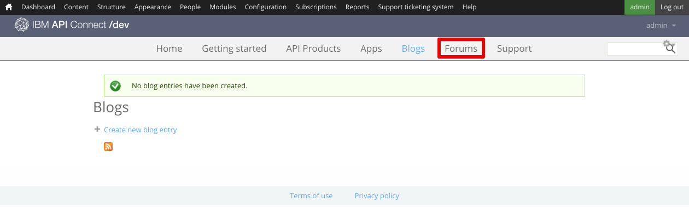
  
11. The Forums page is where developers can have discussions and post questions about your APIs.  When you've finished reviewing the page select **Support**.  
  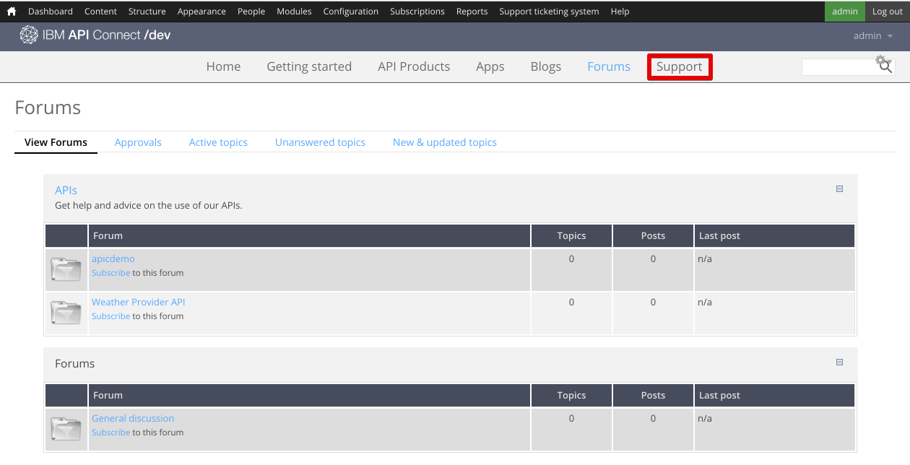
  
12. The Support page is where you can direct developers on how they can receive support on your APIs. For example, you can refer them to your forums and FAQs. You can also provide a link which allows them open up a support ticket if needed.  
  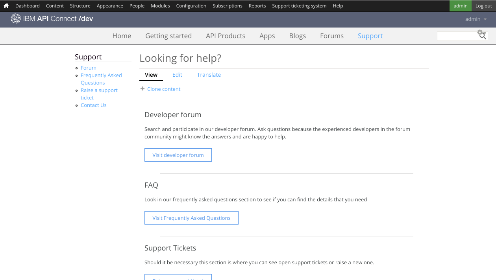

This completes this tutorial.

  

  
