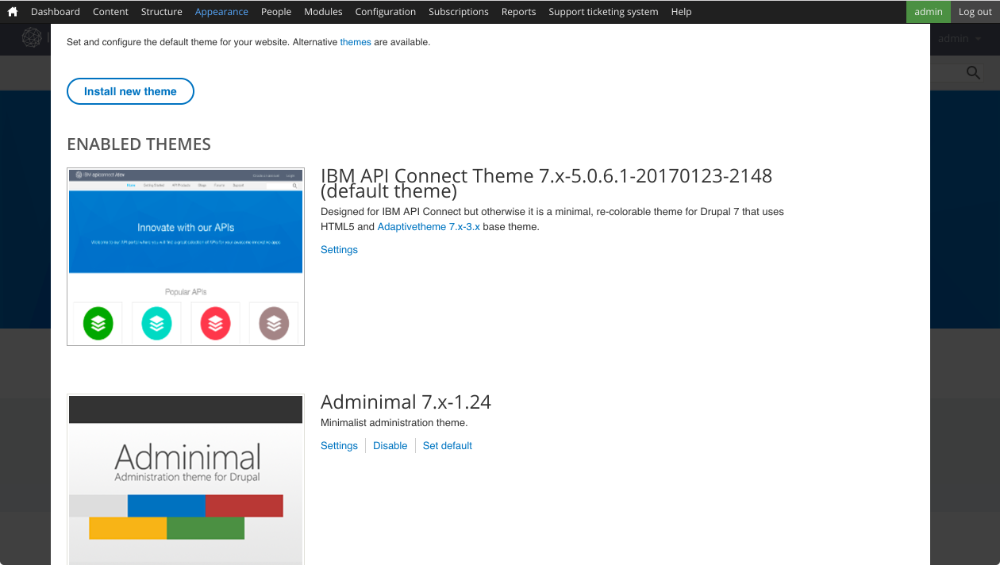
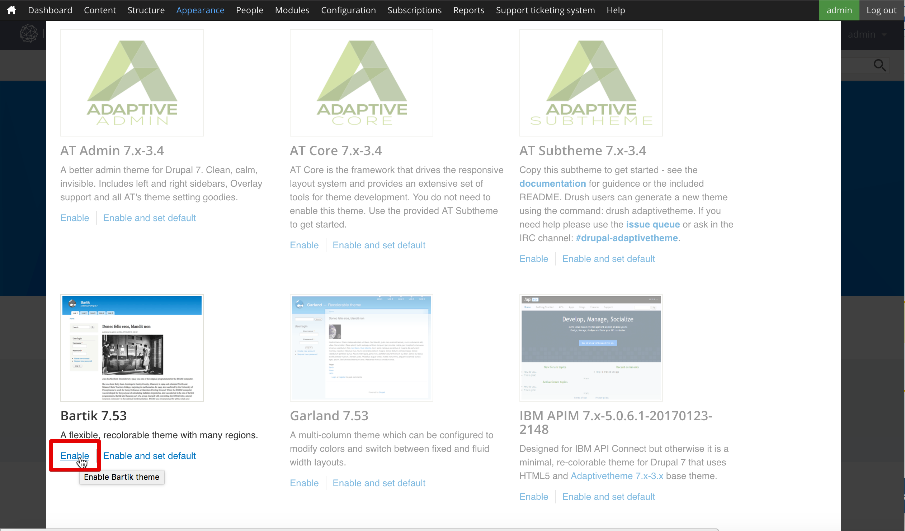
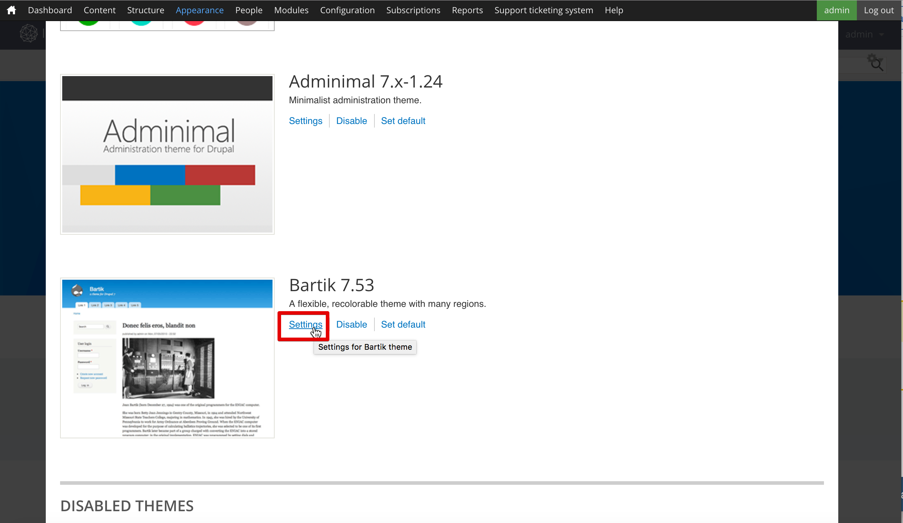

# Set Up and Configure Your Developer Portal
**Duration**: 60 mins  
**Skill level**: Beginner  

### Objective
This tutorial is to help you get started quickly with customizing your **API Connect Developer Portal**. We'll start by configuring the Developer Portal, and then customizing it to suit your needs.

---

### Create your developer portal
In this tutorial, you will create a developer portal for a catalog.

1. In your Bluemix dashboard select your **API Connect** service to launch the API Connect dashboard.

2. In the API Connect dashboard select the catalog for which you want to create a developer portal, for example **Our Demo Catalog**. 

3. In the catalog select the **settings** tab.  
  

4. In the setting tab select **portal**.  
  

5. In the Portal Configuration, Select Portal dropdown select **IBM Developer Portal**.  
   

6. Save your changes.  
  
  
7. Select **OK** to acknowledge the dialog message.  
  

---

### Explorer your developer portal
In this tutorial, you will get acquainted with the developer portal created above.

1. After you configured the developer portal for your catalog above you will receive an email with a link to a one-time login. Select the link to launch the developer portal.

2. Select **Login** to login to the developer portal. 

3. Enter a new password and select **Save**.  
  

4. Now that you've set your password let's explore the developer portal. Select **Home** at the top of the page.  
  

5. The Home page is the welcome page to your developer portal. You can customize this page a we will see later in the tutorial.  When you've finished reviewing the home page select **Getting started**.   
   

6. The Getting started page is used to instruct developers how to get started using your developer portal.  When you've finished reviewing the page select **API Products**.
  

7. The API Products page is used by developers to explore and subscribe to the APIs that are available on your portal.  When you've finished reviewing the page select one of the products.  
  

8. The Product page for an API shows the available plans for the product and enables developers to subscribe to and view the API details.  When you've finished reviewing the page select **Apps**.  
  

9. The Apps page displays the applications that are using your APIs.  When you've finished reviewing the page select **Blogs**.  
  

10. The Blogs page is where you can create and display blog posts about your APIs.  When you've finished reviewing the page select **Forums**.  
  
  
11. The Forums page is where developers can have discussions and post questions about your APIs.  When you've finished reviewing the page select **Support**.  
  
  
12. The Support page is where you can direct developers on how they can receive support on your APIs. For example, you can refer them to your forums and FAQs. You can also provide a link which allows them open up a support ticket if needed.  
  

---

### Customizing your developer portal
Now that you've had a quick tour of the developer portal, in this tutorial you will learn how to customize its look and feel.

1. Let's begin with modifying the Welcome Banner. In the top menu select **Content** then select **Blocks**.  
  

2. Select **edit** in the **Welcome Banner** block.  
  

3. Under the Content heading, to change the Content text and image for the Welcome banner, you can either enter text into the content editor, or select the Edit HTML Source icon to edit or paste HTML directly that defines image and text specifications.  
   

4. Under the Image heading, browse for the required image, and select **Update**.  
  

5. At the bottom of the page select **Save** to save your changes.  
  
---

### Customize the theme for your developer portal
The Developer portal allows you to modify the theme it uses to change its look and feel.

1. To modify the theme from the top menu select **Appearance** then select **Settings** then **IBM API Connect Theme**.  This is the default theme when you created your developer portal above.
   

2. The *Standard Layout* tab allows you to modify the layouts for devices with large screen such as desktops.  The *Tablet Layout* tab allows you to modify the layouts used on tablet devices.  The *Smalltouch Layout* allows you to modify the layouts used on devices such as smartphones.  After inspecting these tabs select **Panels & Gpanels** 
  

3. In addition to modifying the Sidebar layouts above the default theme supports the use of Gpanels, or responsive Panels if you install the Panels module.  To control the panels layout on standard, tablet and smalltouch devices, expand the sections and update the settings.  
   

4. There are other settings that you can adjust but let's skip down and select **Extensions**. This tab allows you to enable additional settings you can use   to configure the styling of your developer portal.  
  

5. The settings of the extensions enabled on the *Extensions* tab can be modified in the **Extensions** section below the main settings.     
  

6. After the settings modifications are complete select **Save configuration** at the bottom of the page.

---

### Select a different theme for your developer portal
The Developer portal comes with additional themes for you to choose from and customize to change its look and feel.

1. To enable a different theme select **List** tab at the top of the Appearance settings.
   

2. At the top of the *Lists* tab the enabled themes are displayed. 
  

3. Below the list of enabled themes are a collection of disabled themes.  You can enable a theme by selecting **Enable**   
   

4. Once the theme is enabled it will appear at the top of the *List* tab in the **Enabled Themes**.  You can customize it by selecting **Settings**.  
  

5. Once you are done modifying the settings you can set the theme as the default by selecting **Set Default**.     
  

---

### Install a new theme for your developer portal
If modifying an existing theme doesn't suit your needs, the Developer portal allows you to install a theme to change its look and feel.

1. You can use modules or themes downloaded from [drupal.org](http://drupal.org) to customize your developer portal or you can create your own.

2. To install a theme into the developer portal from the top menu select **Appearance** then select **Install new theme**.  
  

3. You can install themes directly from [drupal.org](http://drupal.org) using a URL or you can upload a theme you downloaded or created by select **Choose File** and browse for the theme and then select **Install**.  
   

4. When the upload completes we need to enable the theme, select **Enable newly added themes**.  
  

5. Scroll down in the list and find the newly installed theme. Select **Enable and set default**.  
  

6. At the bottom of the page select **Save** to save your changes.  

7. This copletes this tutorial.

  

  
