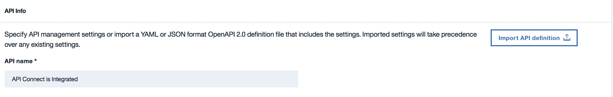
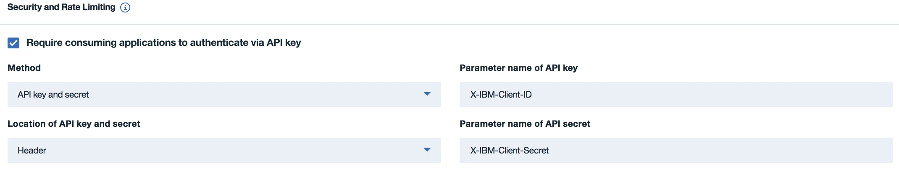
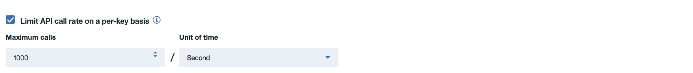
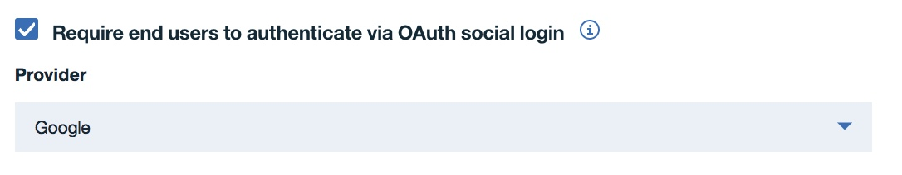
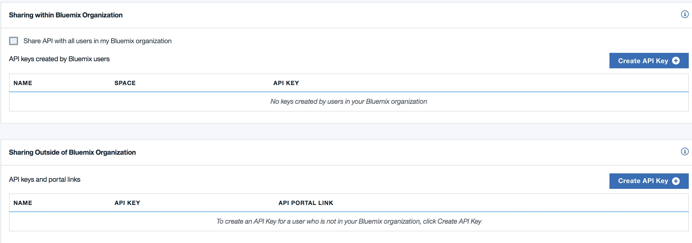
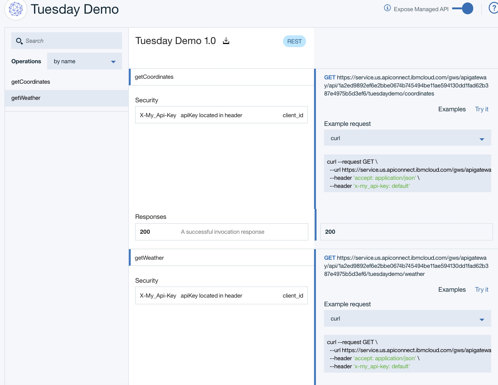
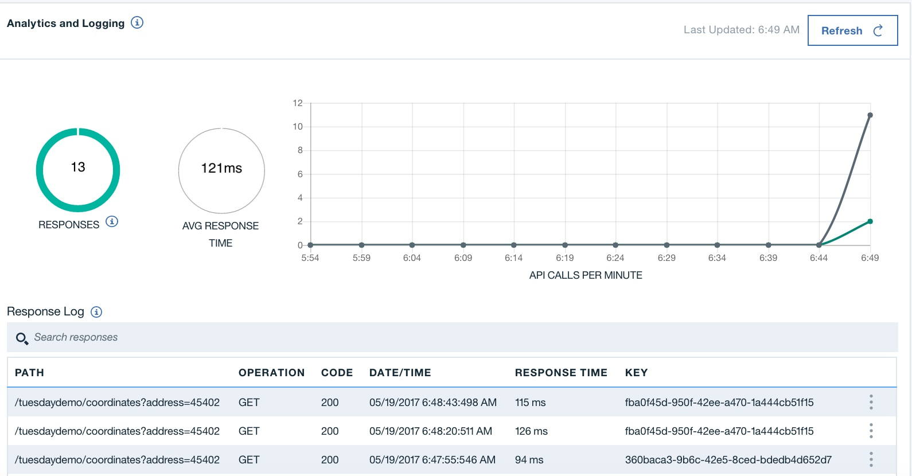

# Getting Started with Bluemix Native API Management in Bluemix Cloud Foundry. 

#### What you'll need
1. IBMid
2. Bluemix account
3. A Cloud Foundry Runtime 
4. (optional) Swagger/OpenAPI Spec for the App (not required) 

<table>
  <tr>
  <td>
  <b>IBMid</b>: Used to access all of IBM's apps, communities, support and more
     
    <b>Bluemix</b>: IBM's cloud platform that hosts API Connect along with other apps and services 
    <b>Cloud Foundry Runtime</b>: Any Cloud Foundry Runtime  
    <b>Optional Swagger/OpenAPI Spec</b>: The most used API tooling in the world, if you have a spec, you can upload it 
    
  </table>  
---
- Sign up for your **IBMid** and create your **Bluemix** account: https://console.ng.bluemix.net/registration/

- _Already have an IBMid? Then skip the registration, and just create your free Bluemix account:_ _https://console.ng.bluemix.net/_  

- Once you have your IBMid and Bluemix account, Go to **Cloud Foundry*** or **create/push a runtime to CF**:
  - Log in to **Bluemix** — IBM’s cloud platform: https://new-console.ng.bluemix.net/login  
    

  - Create your _organization_ in **Bluemix** (you will be prompted to do the first time you log in)  
  
  - Create your _space_  
  
   - Go to _cloud foundry_ in **Bluemix** and [create a new applicaiton](https://console.ng.bluemix.net/docs/cli/plugins/bluemix_admin/index.html#clicreupbuildpack) or [push and existing one]( https://console.ng.bluemix.net/docs/starters/install_cli.html)  

### Now the fun begins.  Let's add API Security and Ratelimiting to an App!
#### Getting there
- Go to a runtime that interests you and click on it
- Select **API Management** on the left navigation

#### The Basics (Naming - uploading swagger)
 - Name you API (optional: you can upload a swagger/OpenAPI Spec, if you have it)
    
- Uploads must be *.json* or *.yaml* and must be complant with OpenAPI Specifications
 
#### Adding Applicaiton level Security
 - API Key and Secret is used to verify and track API usage at the Applicaiton level.  It is **Best practice** and **Highly recommended** to use API Keys when developing APIs.  As the API Developer/Owner, you can track usage, and, if nessesary, delete and reissue keys if they fall into the wrong hands
- Currenly, only "header" security is available.  We will be adding *Query* support soon.  

- Select *API Key* or *API Key and Secret*  You can also customize the parameters from *X-IBM-Client-ID* to anything you want - X-My-API-Key for example.
    
- When you involk you API, your header "key" will be your Key/Secret name (*X-IBM-Client-ID* for example) and the "Value" will be the API key or secret (will create it in a few seconds)

#### Adding Rate Limiting
- Rate limiting is an important part of API Security and Control.  It limits the API involcations on a "Per API Key" basis, so no one user can overwhelm your underlying resources. 
- Select the number of API Calls and the Unit (Per second, minute, hour, day)
 

#### Adding User Level Security (OAUTH 2.0 Social Login Authenticaiton)
- Social login is becoming commmon place and we can use that same Token to validate your application's users
- Select your Social Login providor (Facebook, Google, or Github)
    
- If you do not have OAUTH set up yet for your application visit
    - [Google](https://developers.google.com/identity/sign-in/web/sign-in)
    - [Facebook](https://developers.facebook.com/docs/facebook-login)
    - [Github](https://developer.github.com/apps/building-integrations/setting-up-and-registering-oauth-apps/)
- You can pass your user's Token to the gateway through an *Authenticaiton* Header (Facebook also requires *x-facebook-app-token*) and the gateway will validate it with the applicable Authenication server. 

#### Control, Secure, and Make it live
- That's it, when you click *save* you API is secured and controled!  

#### Navigating the rest of the API Management tool
- Navigating is easy

    - **Summary** shows the basics of the API, including analytics and logs
    - **Definition** is how you can modify the API Definition
    - **API Explorer** is where you can test the API and see how it looks to outside users
    -**Sharing** is how *share with your bluemix organization* or *create external API keys* 

#### Create API Keys and share the documentaiton
- Creating and sharing API keys is as easy as a few clicks.  Additionally, you can quickly share documentation with external users (those outside of your bluemix organization).

    - Enable Bluemix Sharing by checking the *Share API with all users in my Bluemix Organization*
        - This will make your API visible to all developers in your Bluemix Organization at the *space* level (ie, all develpers in *test* will see this API, and be able to try it, create an API Key, and read the documentation)
    - Create an API Key by clicking on **Create API Key** under *Sharing Outside my Bluemix Organization*
    - After *naming* they key, you can copy the key or send a link to the documentation 
        - NOTE: If you selected *API Key and Secret*, The user will be able to create and modify their secret through the link

#### API Explorer
- The API explorer is a handy tool used to quickly test your API 

    - You can get code snipits by selecting a programing langauge in the drop down 
    - You can test by API by selecting *try it* 
        - Note: If you selected API key and secret and/or OAUTH security, you will need those keys (tokens) to test the API

#### Analytics and logs
- You can access API Analytics and Logs from the *Summary* tab
   
    - Tip: Click the **Refresh** button in the UI, not your browser's refresh, to get the latest analytics and logs. 
    - Analytics include
        - **Responses**: Total number of responses and breakdown of the response codes.  Hover over the **i** to get a breakdown (200s, 300s, 400s, 500s)
        - **Average Response Time**: Average response time (in MS) for all API Calls. 
        - **API Calls Graph**: Shows API Key level breakdown of responses over the past hour.
    - Logs allow you to dig into errors quicly.  We hold the last 100 logs for 7 days.  

