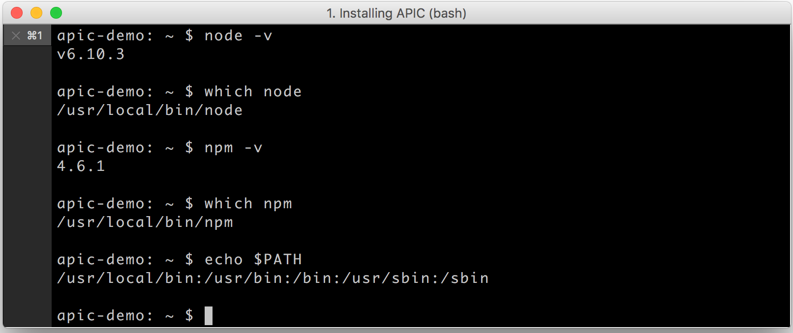

# Installing the API Connect toolkit

### What you'll need
1. Node.js
2. Node Product Manager (NPM)
3. API Connect _Essentials_

<table>
  <tr><td><b>Node.js</b>: An asychronous event driven JavaScript runtime used to build and run scalable network applications
     
    <b>Node Product Manager</b>: JavaScript package manager and software registry 
    <b>API Connect</b>: A free version of API Connect hosted on your laptop</td></tr>
  </table>  

### Install node.js
1. Download and install node.js from one of the two sources:
   * https://nodejs.org/en/download/ (Note: Download the LTS version for your platform, not the latest, or you may experience errors.)
      **OR**
   * https://developer.ibm.com/node/sdk/v6/  

    _Installing node.js also installs **npm** (Node Package Manager)_.

2.  Once Node.js is downloaded and install, check to make sure it is in your _PATH_.
      

3. Update **npm**. In a command line, enter `npm install -g npm`.
   Note: Setting npm `--engine-strict` or `npm config set engine-strict true` prevents installation from completing.

4. Check the installed version and path.
     

### Install the API Connect toolkit
1. Update the npm config to allow use of untrusted certificates.  
   `npm config -g set strict-ssl false`  

2. Install the API Connect toolkit from **npm**.  
    `npm install -g apiconnect`

3. Check the installed version.  
    `apic -v`

### Install the Microgateway
We'll use the Microgateway as a local test server for this tutorial.

 In a command line, enter `npm install -g microgateway`.

 
