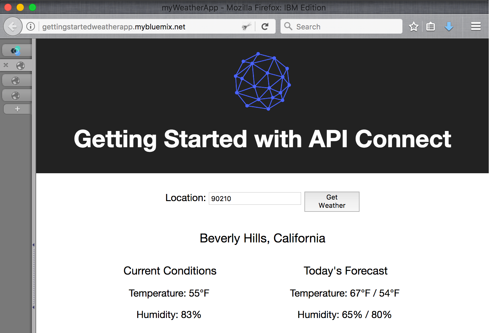
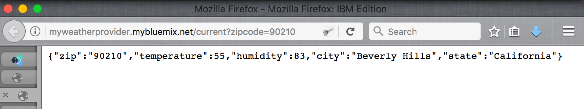
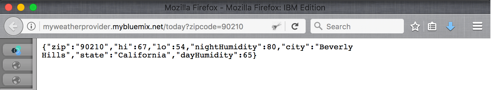
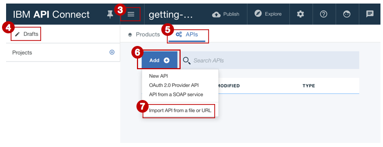

# Import your API spec, and proxy an existing REST service  
**Duration:** 5 mins  
**Skill level:** Beginner  

## Objective
This tutorial helps you get started quickly with IBM API Connect by illustrating how you can bring your existing API under management control. You'll start by importing an OpenAPI spec, and then create a passthrough API proxy for an existing REST service.  

## Prerequisites
Before you begin, you will need to <a href="https://github.com/ibm-apiconnect/getting-started/tree/master/bluemix/0-prereq" target="blank">set up your API Connect instance</a> and <a href="https://github.com/ibm-apiconnect/getting-started/blob/master/toolkit/0-Prereq" target="blank">install the API Connect toolkit</a>.  

---

## Explore the sample app and test the target endpoints
A sample _weather provider_ app has been created for this tutorial. Its corresponding API specification (Swagger 2.0) can be found .
1. To explore the app, go to http://gettingstartedweatherapp.mybluemix.net/.  
2. Enter a valid 5-digit U.S. zipcode to get the _**current weather**_ and _**today's forecast**_.  


3. The above sample weather app was built using APIs that provide the weather data. The endpoint to get the **current** weather data is _**https:// myweatherprovider<span></span>.mybluemix.net/current?zipcode={zipcode}**_. Test it out by visiting https://myweatherprovider.mybluemix.net/current?zipcode=90210.  
  

4. Similarly, the Endpoint to get **today's** forecast data is _**https:// myweatherprovider<span></span>.mybluemix.net/today?zipcode={zipcode}**_. Test it out by going to https://myweatherprovider.mybluemix.net/today?zipcode=90210.  
  


---

## Import the sample app's OpenAPI spec to create a REST API proxy
1. Launch the **API Designer**. In your terminal window, enter the following command: `apic edit`.
2. Log in using your IBMid.
    
3. In the **API Designer**, ensure that the navigation panel is open.  
4. In the navigation panel, click **Drafts**.  
5. Then go to the **APIs** tab.
6. In the **APIs** tab, click **Add**
7. From the drop-down menu, click **Import API from a file or URL**.  
    

8. In the "Import OpenAPI (Swagger)" dialog box, enter this URL:
https://raw.githubusercontent.com/ibm-apiconnect/getting-started/master/toolkit/1a-import/weather-provider-api_1.0.0.yaml. Leave the _Add a product_ option unchecked and click **Import**.  
      
9. In the API's **Design** view, scroll down to the **Host** panel.   
_You'll notice that the Host value is set to_ ```$(catalog.host)``` _. This sets the base URL for your API proxy._
 


## Test your API proxy
### Test with the _API Manager test tool_.
1. Go to the **Assemble** tab.
2. Start the local test server by clicking the **Start servers** icon.
    

3. Click the play icon (►) to test your API proxy's target invocation.
    

4. In the test panel, 
   a. Click the **get /current** operation.  
   b. Zipcode is a required parameter for this operation, so enter a valid U.S. zip code (for example, 90210).  
   c. Click **invoke**, and verify the response.  
    _If you run into a CORS error, follow the instructions in the error message. Click the link in the error to add the exception to your browser, and then     hit the "invoke" button again._  
   d. The expected response is:   
    ```
    200 OK response
    Current weather data for 90210
    ```  
        


### Test with the _Explore tool_  
_The Explore Tool allows users to test the correct operation of the API by enforcing any parameter requirements that are set in the OpenAPI definition. This enforcement is not done in the API Test Tool found in the Assemble tab, so it allows the user to verify the API behavior when the parameter is missing._  

1. To test your API proxy endpoints, click **Explore**.  
     
2. Click the **GET /current** operation from the palette.
3. Click "Try it".  
4. Enter a valid U.S. zip code (for example, 90210) in the test box.
5. Click **Call operation** to see the response.  
  

## Conclusion

In this tutorial, you saw how an existing REST service can be invoked through an API passthrough proxy. You started by checking the availability of the sample service through the web browser. Then you created an API proxy in API Connect, and linked the proxy to the sample service to be invoked. Finally, you tested this service with API Connect's internal testing tools.
