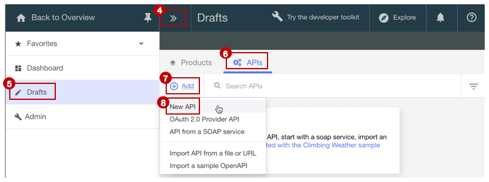
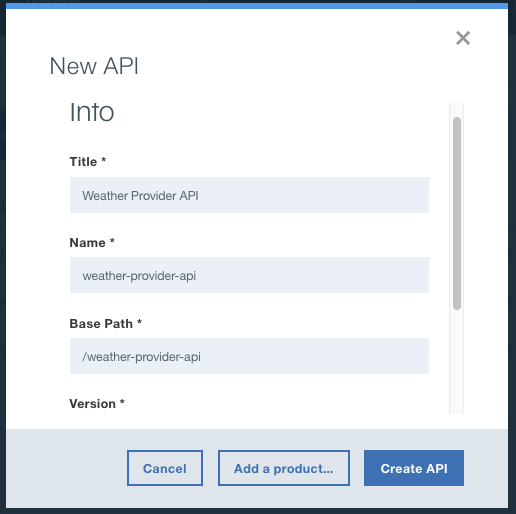
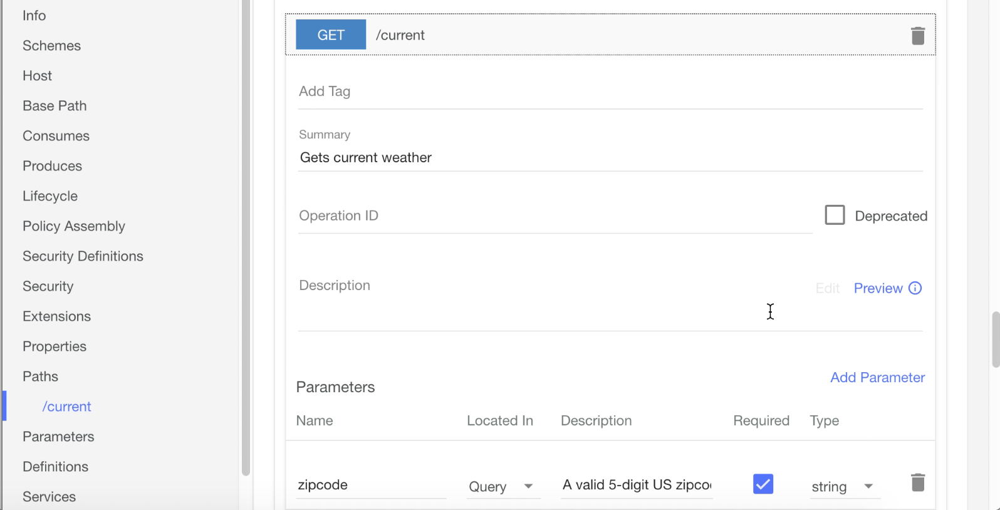
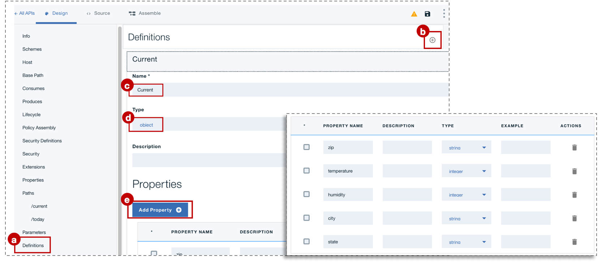

# Add a new API spec and invoke an existing REST service using the Developer Toolkit
**Duration**: 15 mins  
**Skill level**: Beginner  


## Objective
This tutorial helps you get started quickly with **IBM API Connect** by illustrating how you can bring your existing API under management control. You'll start by creating a new OpenAPI spec, and then create a passthrough API proxy for an existing REST service.  

## Prerequisites
Before you begin, you will need to <a href="https://github.com/ibm-apiconnect/getting-started/tree/master/bluemix/0-prereq" target="blank">set up your API Connect instance</a> and <a href="https://github.com/ibm-apiconnect/getting-started/blob/master/toolkit/0-Prereq" target="blank">install the API Connect toolkit</a>.  


---


## Explore the sample app and test the target endpoints
A sample _weather provider_ app was created for this tutorial.
1. To explore the app, go to http://gettingstartedweatherapp.mybluemix.net/.  
2. Enter a valid 5-digit US zip code to get the _**current weather**_ and _**today's forecast**_.  
  

3. The sample weather app, shown above, was developed using APIs that provide weather data. The endpoint to get the **current** weather data is _**https:// myweatherprovider<span></span>.mybluemix.net/current?zipcode={zipcode}**_. Test it out by going to https://myweatherprovider.mybluemix.net/current?zipcode=90210.  
    

4. Similary, the Endpoint to get **today's** forecast data is _**https:// myweatherprovider<span></span>.mybluemix.net/today?zipcode={zipcode}**_.Test it out by going to https://myweatherprovider.mybluemix.net/today?zipcode=90210.  
  

---

## Add a new OpenAPI spec and invoke an existing REST service
1. Launch the terminal on your laptop. In the terminal, enter `apic edit` to launch the **API Designer**.
2. Log in using your IBMid.
      
4. In the **API Designer**, ensure the navigation panel is open. If not, click **>>** to open it.  
5. In the navigation panel, click **Drafts**.
6. Then go to the **APIs** tab.  
7. In the **APIs** tab, click **Add**   

8. In the drop-down menu, click **New API**.
      
    
9. In the **New API** window, enter "Weather Provider API" for the title. _The Name and Base Path are auto-populated_. 
     

10. Click **Create API** to complete the wizard. Once you've created your OpenAPI spec, you are taken to the **Design** view.  

11. In the **Design** view, scroll to the **Host** panel. 
12. Enter ```$(catalog.host)``` as the value, if the field is not automatically filled in.  
13. Scroll to the **Security** tab, and delete the "clientIDHeader (API Key)" that has been been auto-generated.  
> _(You will cover security with API Keys in the next tutorial.)_   

14. In the side navigation panel:  
    a. scroll down to the **Paths** panel.   
    b. Create a new path by clicking **+**.   
    c. Name the new path "**/current**".  
    d. In the same *Paths* panel, click on **GET /current** to open that section.    
    e. In the **GET /current** section, add a new **Parameter**. As you noticed while exploring the , the weather service requires zipcode as a parameter.  
       - Name: zipcode  
       - Located in: Query  
       - Required: Yes (check mark)  
       - Type: string   
      
     

15. With your query parameters defined in the previous step, you need to now define the response object that is returned when you incoke the weather API. To do so, in the navigation panel:  
    a. Scroll down to the **Definitions** panel   
    b. Add a new definition  
    c. Name the new definition _Current_  
    d. Set the Type to _Object_   
    e. Add new properties for the **Current** definition.    
       - Name: zip         /  Type: string   
       - Name: temperature /  Type: integer   
       - Name: humidity    /  Type: integer   
       - Name: city        /  Type: string   
       - Name: state       /  Type: string   
      
  

16. In the previous step, you defined the response object. Next you'll need to ensure the response object is associated with the **get /current** path.  
    In the left side-navigation panel, scroll back up to the **Paths** panel.  
    a. Open the **GET /current** operation, and scroll to the **Responses** section.  
    b. Change the schema of the 200OK response from "object" to "**Current**".  
    c. Save your API.  
    > _The path and operation you created was to get the current weather data. Next, you'll need to create a similar path and operation to get today's weather data._   

17. Similar to how you created the **/current** path in the previous steps, create a new path: **/today**.  
18. Add a new Parameter under the **GET /today** operation.
      - Parameter Name: zipcode
      - Located in: Query
      - Required: Yes (check mark)
      - Type: string  

19. Create a new definition: **Today**.
20. Add new properties for the **Today** definition.
      - Name: zip / Type: string
      - Name: hi / Type: integer
      - Name: lo / Type: integer
      - Name: nightHumidity / Type: integer
      - Name: dayHumidity / Type: integer
      - Name: city / Type: string
21. Update the response schema in the **GET /today** section to "Today".
22. Save your API.

23. Switch over to the **Assemble** tab. You've got two operations so far: **GET /current** and **GET /today**. To ensure the right target endpoint is invoked, you'll need to create some logic that will execute conditional on the operation that's being called. Let's use the **Operation Switch** logic construct to do this.  
    a. Delete the **invoke** policy that may already be added to the _canvas_.  
    b. From the _palette_, drag the **Operation Switch** and drop it on the canvas.  
       - To **case 0**, assign the **get /current** operation.
       - Add a new Case: **case 1**.
       - Assign the **get /today** operation to **case 1**.
         
       >The **Operation Switch** provides a decision point. Based on the verb/path pair, the appropriate operation must be invoked.    
    
    c. Drag the **invoke** policy from the palette and drop it on the canvas. 
       - Drop one in the **/get current** path and one in the **/get today** path.
       - Select the **invoke** policy in the **/get current** path, and update its title to "**invoke-current**".  
       - Update the URL field with: https://myweatherprovider.mybluemix.net/current?zipcode=$(request.parameters.zipcode).
       - Select the **invoke** policy in the **/get today** path, and update its title to "**invoke-today**".  
       - Update the URL field with: https://myweatherprovider.mybluemix.net/today?zipcode=$(request.parameters.zipcode).  
 24. Save your API.

---

### Test your API proxy
1. Start the local test server by clicking the Start servers icon on the bottom left of the designer. Once the Gateway is started, you would see the status update automatically to Running.  
    

2. Switch over to the Assemble tab.  

3. Click the play icon (►) to test your API proxy's target invocation.
   > _For this tutorial, we shall use the embedded Micro Gateway, so ensure Micro Gateway Policies is selected._  
   
    

4. In the test panel:  
    a. Choose the **get /current** operation.  
    b. Zipcode is a required parameter for this operation, so enter a valid U.S. zip code (for example, 90210).  
    c. Click **invoke**, and verify the response.  
   > _If you run into a CORS error, follow the instructions in the error message. Click the link in the error to add the exception to your browser, and then hit the "invoke" button again._   
   
  d. The expected response is a **200 OK** response code along with  the current weather data for 90210.  
    
      

  
---

## Conclusion
In this tutorial, you saw how an existing REST service can be invoked through an API passthrough proxy. You started by checking the availability of the sample service through the web browser. Then you created a new OpenAPI spec in API Connect, and linked it to the sample service to be invoked. Finally, you tested the API proxy with the built-in testing tool.
