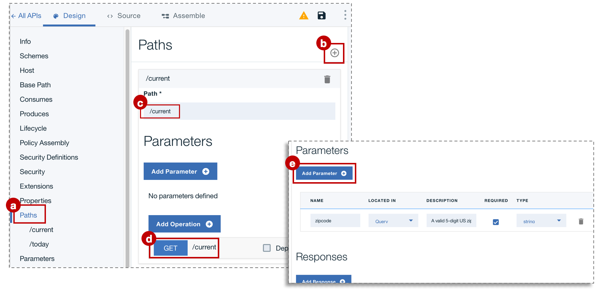

# Add a new API spec and invoke an existing REST service
**Duration**: 15 mins  
**Skill level**: Beginner  


### Objective
This tutorial is to help you get started quickly with **API Connect**. We'll start by creating a new OpenAPI spec, and then proxy existing REST services used by the sample weather app.

---


### Explore the sample app and test the target endpoints
A sample _weather provider_ app has been created for this tutorial.
1. Explore this app here: http://gettingstartedweatherapp.mybluemix.net/.
2. Enter a valid 5-digit US zipcode to get the _**current weather**_ and _**today's forecast**_.


3. Use this endpoint to get the **current** weather data:     _**https:// myweatherprovider<span></span>.mybluemix.net/current?zipcode={zipcode}**_.
  - Test it out by clicking: https://myweatherprovider.mybluemix.net/current?zipcode=90210.  
  

4. Use this endpoint to get **today's** forecast data:  
   _**https:// myweatherprovider<span></span>.mybluemix.net/today?zipcode={zipcode}**_.
  - Test it out by clicking: https://myweatherprovider.mybluemix.net/today?zipcode=90210.  
  


---

### Add a new OpenAPI spec and invoke an existing REST service
1. Launch the **API Designer**
  - In your terminal, enter `apic edit`
  - Log in using your IBMid
    
  - In the **API Designer** navigation panel (left hand), click on **Drafts > APIs**
  - In the **APIs** panel, click on **Add > New API**
  - In the New API pop-up, enter "Weather Provider API" for the title.  _The Name and Base Path are auto-populated_  
  - Select **Create API** to complete the wizard.  


2. Once your API is created, you should be in the **Design** tab.
  - Scroll down to the **Host** panel, and note the value that's filled in: ```$(catalog.host)```.  
  - In the **Base Path** panel, note the auto-populated value: ```/weather-provider-api```.  
  - Your API's target URL will be created from these values.  


3. Scroll down to the **Security** tab, and delete the "clientIDHeader (API Key)" that has been been auto-generated.  
_(We'll visit security with API Keys in the next tutorial.)_  


4. In the **Paths** panel, create a new path.
  - Name it "**/current**".  
  - In the same **Paths** panel, click on the **GET /current** section.  
  - Add a new Parameter.  
    - Name: zipcode
    - Located in: Query
    - Required: Yes (check mark)
    - Type: string
    
  - Save your API.

5. In the **Definitions** panel, add a new definition.
  - Name: Current  /  Type: Object
  - Add new properties for the **Current** definition.
    - Name: zip         /  Type: string
    - Name: temperature /  Type: integer
    - Name: humidity    /  Type: integer
    - Name: city        /  Type: string
    - Name: state       /  Type: string
    
  - Save your API.  


6. Scroll back up to the **Paths** panel.
  - Open the **GET /current** operation, and scroll to the **Responses** section.
  - Change the schema of the 200OK response from "object" to "**Current**".
  - Save your API.
  - The path and operation you created was to get the current weather data. Next you'll need to create the same to get today's weather data.  

7. Create a new path: **/today**.
  - Add a new Parameter under the **GET /today** operation.
    - Parameter Name: zipcode
    - Located in: Query
    - Required: Yes (check mark)
    - Type: string  

8. Create a new definition: **Today**.
  - Add new properties for the **Today** definition.
    - Name: zip / Type: string
    - Name: hi / Type: integer
    - Name: lo / Type: integer
    - Name: nightHumidity / Type: integer
    - Name: dayHumidity / Type: integer
    - Name: city / Type: string
    - Name: state / Type: string
  - Update the response schema in the **GET /today** section to "Today".
  - Save your API.

9. Switch over to the **Assemble** tab. You've got two operations so far: **GET /current** and **GET /today**. To ensure the right target endpoint is invoked, you'll need to create some logic that will execute conditional on the operation that's being called.
- Let's use the **Operation Switch** logic construct to do this.  
  - First, delete the **invoke** policy that may already be added to the _canvas_.  
  - Then, from the _palette_, drag the **Operation Switch** and drop it on the canvas.  
  - To **case 0**, assign the **get /current** operation.
  - Add a new Case: **case 1**.
  - Assign the **get /today** operation to **case 1**.
    
  - The **Operation Switch** provides a decision point. Based on the verb/path pair, the appropriate operation needs to be invoked.  

- Drag the **invoke** policy from the _palette_ and drop it on the canvas. Drop one in the **/get current** path, and one in the **/get today** path.
  - Select the **invoke** policy in the **/get current** path, and update its title to "**invoke-current**".  
  - Update the URL field with: _**https:// myweatherprovider<span></span>.mybluemix.net/current?zipcode=$(request.parameters.zipcode)**_.
  - Select the **invoke** policy in the **/get today** path, and update its title to "**invoke-today**".  
  - Update the URL field with: _**https:// myweatherprovider<span></span>.mybluemix.net/today?zipcode=$(request.parameters.zipcode)**_.  
  - Save your API.


---

### Test your API proxy

###### Test with the _API Manager test tool_
- In the **Assemble** tab,
  - Start the local test server by clicking on **Start servers** icon at the bottom of the screen
    

- Click ► to test your API proxy's target invocation
    

  - In the test panel, select the **get /current** operation.  
  - Zipcode is a required parameter for this operation, so enter a valid US zip (e.g. 90210).  
  - Click **invoke**, and verify that you see:
    - 200 OK response
    - Current weather data for 90210   
      


###### Test with the _Explore tool_  
- To test your API proxy endpoints
  - Click the _Explore_ button
  - Click on the **GET /current** operation from the palette
  - Enter a valid US zipcode (e.g. 90210) in the test box
  - Click **Call operation** to see the response  
    
  
---

###### Conclusion

In this tutorial, you saw how an existing REST service can be accessed by building an API. We started by checking the availability of the sample service through the web browser. Then we created an API in API Connect, and built the connections in the API Design editor.  Finally, we tested the API with the built-in testing tool.
