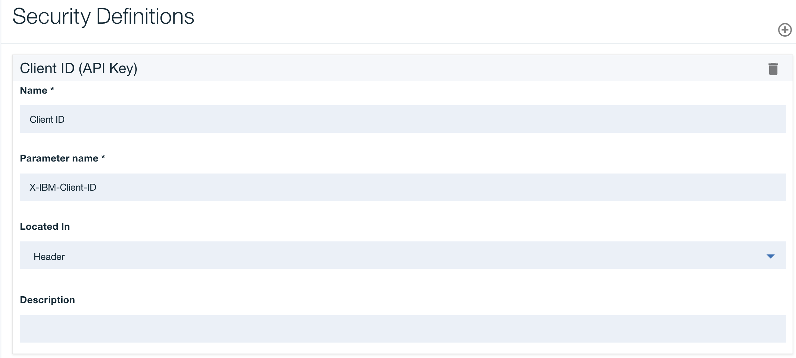
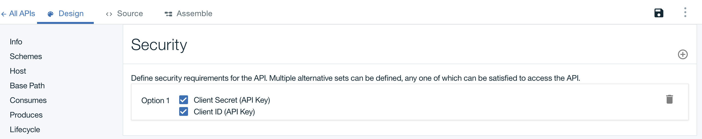
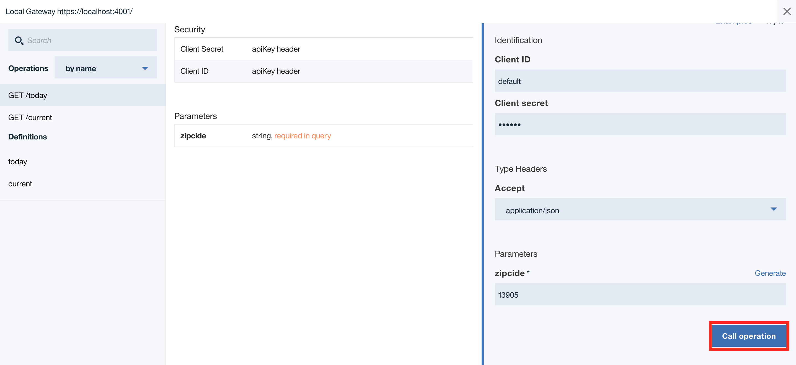

# Secure your API with a client ID and secret

Duration: 10 mins

Skill level: Beginner

### Objective

This tutorial will guide you through securing your API with the keys so that any application calling your API would need to supply the Client ID and Client Secret keys. In this tutorial, we will modify the same API we are working with.

### Prerequisites
Before you begin, you must have completed one of the following tutorials:
- [Import an OpenAPI2.0 spec and proxy an existing REST service](https://github.com/ibm-apiconnect/getting-started/blob/master/toolkit/1a-import)
- [Add a New API Spec and Invoke an Existing REST Service](https://github.com/ibm-apiconnect/getting-started/blob/master/toolkit/1b)

### Set the identification mechanism of your API

1. Start up API Connect. 
- Open your terminal.
- Enter **apic edit** into the command line.
- Select **Sign in with Bluemix**.
- Enter your Bluemix login information.

2. Navigate to your API's Design view.
- Select **Drafts > APIs**.
- Select the Weather Provider API. This opens up the **Design** view.
      

3. In the Design view, scroll down to **Security Definitions**.
- Select **+ > API Key** and add two new API keys:
     
   - Name: Client ID; Parameter name: X-IBM-Client-ID
   - Name: Client Secret; Parameter name: X-IBM-Client-Secret
   - For both new keys, ensure that the **Located In** field is set to "Header".
       

4. Scroll down to the **Security** panel and add a new security option.
- Select the newly created Client ID and Client Secret keys.
    
     
    
- Save your API. 

### Test the changes made to your API

1. In the Assemble tab, click ► to test your changes.
- Select the **get /current** operation in the test panel.
- Scroll down in the Test panel, and notice that the Client ID and Client Secret values have already been populated. These are test values that are generated for your sandbox, and represent the keys of the application that will be using your API.
    _[ Note: The Client ID and Client Secret keys can also be found under  Dashboard > Catalog > Settings > Endpoints ]_
    

2. Scroll further down and enter a zip code (e.g. 90210). Click **Invoke**.
- You should get a 200 OK response, along with the message body returning the weather information.

3. Scroll back up to the Client ID field. Replace the Client ID value with a random one.

4. Rerun the test by clicking **Invoke**.
- You'll see a 401 Unauthorized response, together with the message "Client ID not registered".
    

### Call your API using the Client ID and Client Secret

The security settings can also be tested using the Explore tool that explicitly calls the proxy endpoint, and passes the Client ID and Client Secret keys as header values.

1. Select **Explore > Sandbox**.
2. Select the **GET /current** operation from the list.
3. In the right-hand column, select **Call operation** to rerun the test.
    

### Conclusion
In this tutorial, you learned how to set the identification mechanism of your API, test changes made to your API, and call your API using the client ID and client secret. 
